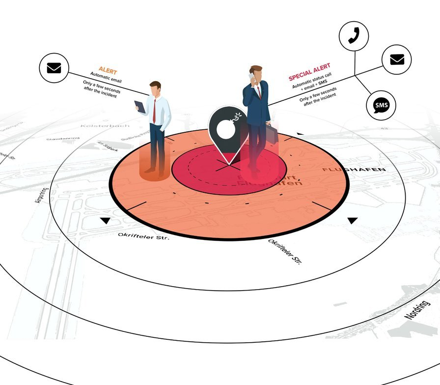

# TRAVEL EYE PLATINUM

## 紹介動画



## 商品紹介

Travel Eyeは、24時間年中無休で世界中で発生した治安事件を特定する**モビリティ・リスクマネジメントプラットフォーム**であり、事件発生時には、発生場所と貴社の渡航予約データとを照合し、渡航者が事件現場周辺の一定の半径内に滞在する場合には、自動的に連絡を取ります。

Travel Eyeを活用することで、たった2分で全ての渡航者が無事であるか、また支援が必要であるかを把握することができます。非常時あるいはステータスのリクエストがあった場合には、本プラットフォームを通じて、緊急呼出しや現在地の共有（許可を得ている場合）が可能となります。

## 主な機能

Travel Eyeにより以下のことが可能となります:

* 渡航リスクを特定し、最小限にとどめる
* 渡航データを統合し、渡航者のロケーションとサイトを表示する
* 人工知能を活用し、渡航者に影響を及ぼす治安事件を迅速に特定する
* 渡航者の滞在先と治安事件が発生している現場とを瞬時に照合する
* アラートを受信した渡航者の状況を迅速に確認し、ステータスを管理者に伝達する
* 従業員が慣れ親しんだ言語を用いたコミュニケーション
* 支援が必要となった際に管理責任者に警告し、緊急支援措置を自動的に実行する

## 本マニュアルの目的

本マニュアルは、モビリティ・リスクマネジメントプラットフォームであるTravel Eyeの重要な機能および特徴を伝えることを目的としています。主にプラットフォームの担当者や管理者向けに書かれたものですが、 権限を有しないユーザーにとっても役立つ内容となっています。各セクションの最後には、ユーザーからの質問と返答をまとめた「よくある質問」のページを設けています。


**注意事項**: 本マニュアルはユーザーガイドであり、プラットフォームのアラートプロセスや導入・認証・ログイン手続に関する技術的な詳細情報を提供するものではありません。


