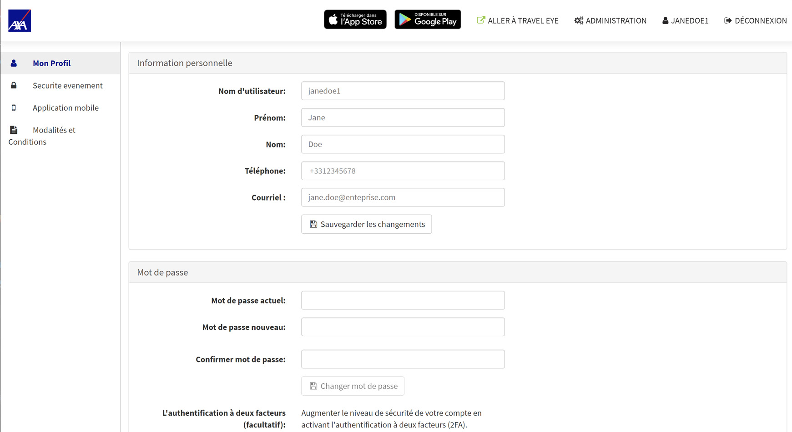

# Profil d'utilisateur

## Comment puis-je gérer mon compte personnel ?

Le profil d'utilisateur sur la plateforme est un élément important. C'est là que les utilisateurs peuvent gérer leur **compte personnel**. Ils peuvent définir leur nom, leur adresse électronique et leur numéro de téléphone qui servent de coordonnées principales pour la plateforme en cas d'urgence et pour toute autre information.


La plateforme donnera la priorité aux coordonnées du profil de l'utilisateur plutôt qu'à celles qui se trouvent dans les données sur le voyage transférées automatiquement, car toute donnée fournie par la personne/le voyageur est supposée être plus précise.


En outre, les utilisateurs peuvent choisir leur langue et leur fuseau horaire préférés. Si les utilisateurs se connectent avec un _nom d'utilisateur_ et un _mot de passe_, ils peuvent aussi changer leur mot de passe ici.

Pour plus de sécurité, ils peuvent aussi activer _l'authentification à deux facteurs_ pour leur compte. Les utilisateurs peuvent également déterminer leur pays de travail personnel dans leur profil.


Veuillez noter qu'un voyageur ne reçoit pas de PTI pour ce pays particulier si le paramètre PTI « ignorer le pays de travail » est activé.


