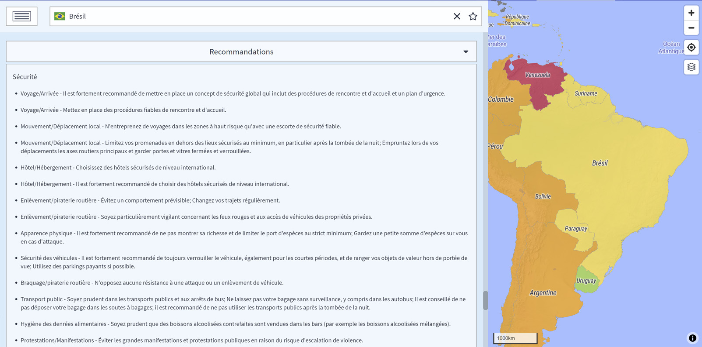

# Recommendations

Chaque pays dispose d'une liste de recommandations clés qui, lorsqu'elles sont suivies, réduisent considérablement les risques liés aux voyages. Il en va de même pour les recommandations médicales. La rubrique « _Conseils spécifiques_ » est particulièrement intéressante, car elle fournit des recommandations spéciales et des informations détaillées sur un risque spécifique prévalant dans le pays concerné.

