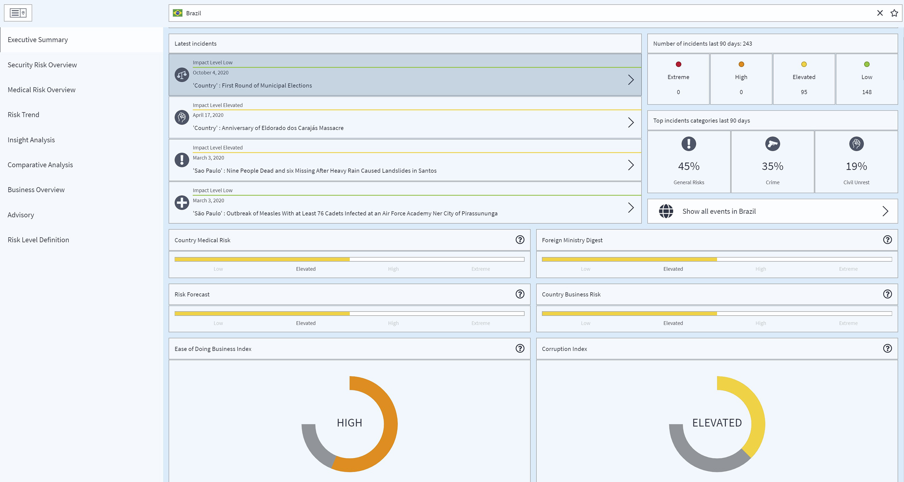

# エグゼクティブサマリー

エグゼクティブサマリーは、その国の過去および未来の治安事件に関する概要を伝えます。 ユーザーは直近4件の事件を即座に目にし、過去数カ月の事件の発生頻度から全体像を理解するとともに、その国にとって最も重要な事件カテゴリーを把握することができます。

これにより、ユーザーは現地の治安状況や渡航者にとっての最大の脅威に関する理解を深めることが可能となります。「世話をする」セクションを確認することで、渡航前と渡航中に検討すべきテーマを即座に判断することができます。 

