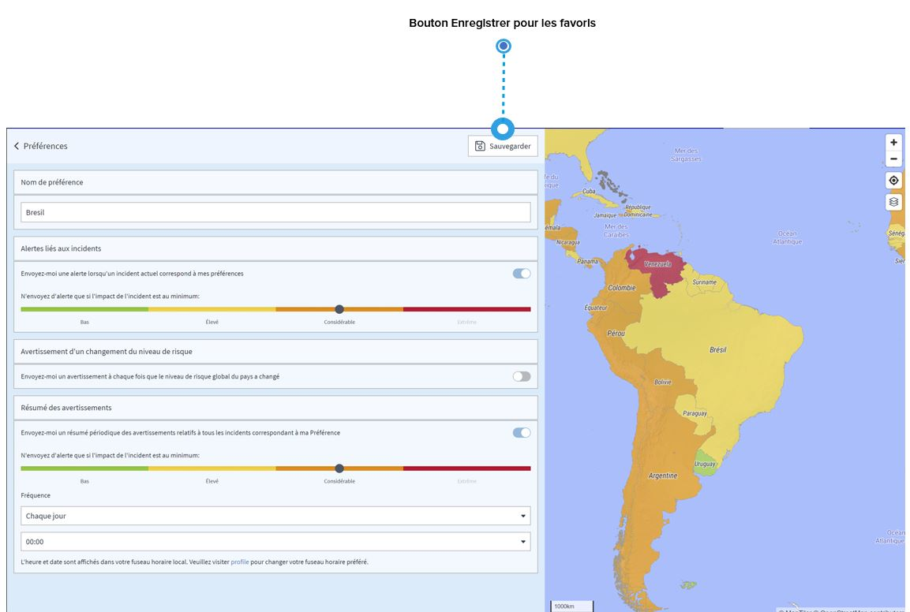

# Pays favoris

Si vous vous intéressez à des pays spécifiques, vous pouvez les enregistrer comme favoris. Quels en sont les avantages ?

* Vous pouvez y accéder **directement à partir de la page des risques pays** en le sélectionnant le pays que vous voulez dans la liste des favoris, qui s'affiche lorsque vous cliquez/touchez dans la barre de recherche à gauche de la page. 
* Plus important encore, **\*\*vous pouvez recevoir des** informations relatives à la « sécurité »\*\* si quelque chose se passe dans le pays. Il suffit de sélectionner « M'envoyer une alerte », puis de choisir à partir de quel niveau d'impact sur vous souhaitez recevoir les alertes et de cliquer sur « Sauvegarder ». 
* Vous pouvez recevoir un **résumé des informations relatives à la sécurité** pour vos pays favoris. Supposons que vous souhaitiez recevoir une fois par semaine à 9h00 et un aperçu de tous les événements survenus dans le pays au cours des 7 derniers jours. Il suffit d'aller sur « Résumé des alertes », de définir vos paramètres individuels et de « sauvegarder/mettre à jour » votre favori. 
* Vous pouvez également recevoir des **alertes de changement du niveau de risque** si le niveau global du risque pays change. 


Les informations relatives à la sécurité que vous recevez sont des informations sur les événements qui se produisent dans le pays. Elles ne sont pas liées à la localisation d'un voyageur spécifique, par exemple des géocoordonnées. En outre, tous les niveaux d'autorisation ont accès à ces paramètres, y compris les voyageurs.


