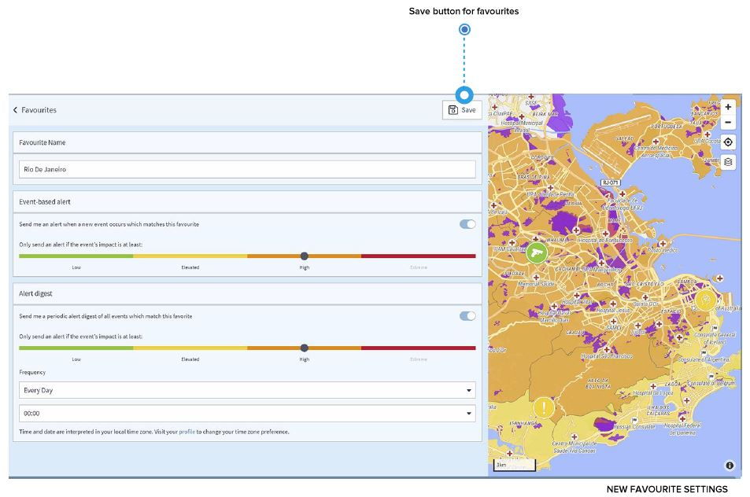

# お気に入り登録

特定の国に関心がある場合、お気に入り登録をすることができます。どのような利点があるのでしょうか？

* ページ左側の検索バーをクリックした際に表示される、お気に入りの候補国リストから選択することで、**カントリーリスクページからの直接**アクセスが可能です。
* さらに重要なこととして、対象国で事件が発生した場合には、その国の**「セキュリティ情報」**を受信します。「アラートを送ってください」を選択し、どの影響度レベルからアラートの受信を希望するかを選び、「保存」します。 
* お気に入り指定国の **セキュリティ情報ダイジェスト**を受け取ることも可能です。例えば、1週間に1度午前9時に、直近7日間で発生した全ての事件についての概要を入手したい場合、「アラートダイジェスト」から個人設定を行い、お気に入りの「保存/更新」を実行してください。 
* その国の全体的なリスクレベルに変更があった場合には、**リスクレベル変更アラート**を受け取ることも可能です。


受信するセキュリティ情報は、対象国で発生している事件に関する情報です。地理座標など、特定の渡航者の位置情報とは関連していません。さらに、渡航者を含む全ての権限レベルのユーザーがこれらの設定を行うことができます。


