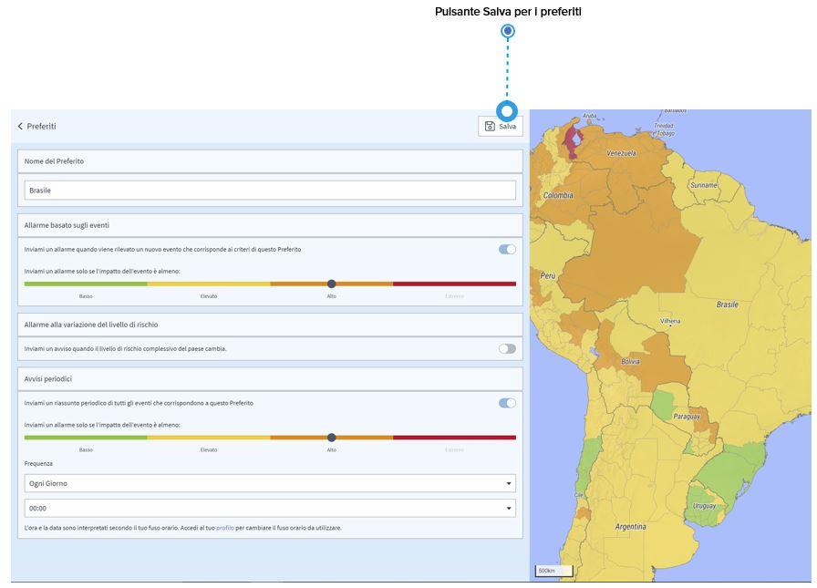

# Paesi Preferiti

Se siete interessati a paesi specifici, potete salvarli come preferiti. Quali sono i vantaggi?

* Potete accedervi **direttamente dalla pagina dei rischi del paese** selezionandolo dall'elenco dei preferiti, che viene visualizzato cliccando/toccando nella barra di ricerca a sinistra della pagina. 
* Cosa ancora più importante, è possibile ricevere "**informazioni di sicurezza**" del Paese se nel Paese accade qualcosa. Basta selezionare "inviami un allarme", scegliere il livello di impatto da cui si desidera ricevere gli avvisi, e poi cliccare/toccare "salva". 
* Potete ricevere un **riepilogo delle informazioni di sicurezza** per i vostri paesi preferiti. Supponiamo che desideriate ricevere una volta alla settimana alle 9:00 del mattino una panoramica di tutti gli eventi che si sono verificati nel paese negli ultimi 7 giorni. Basta andare su "Riepilogo Allarmi", definire le impostazioni individuali e "salvare/aggiornare" il vostro preferito. 
* Potete anche ricevere **allarmi di cambiamento del livello di rischio** in caso di cambiamento del livello di rischio complessivo del Paese. 


Le informazioni di sicurezza che ricevete sono informazioni su eventi che si verificano nel paese. Non sono collegate alla posizione specifica di un viaggiatore. Inoltre, tutti i livelli di autorizzazione hanno accesso a queste impostazioni, compresi i viaggiatori.


