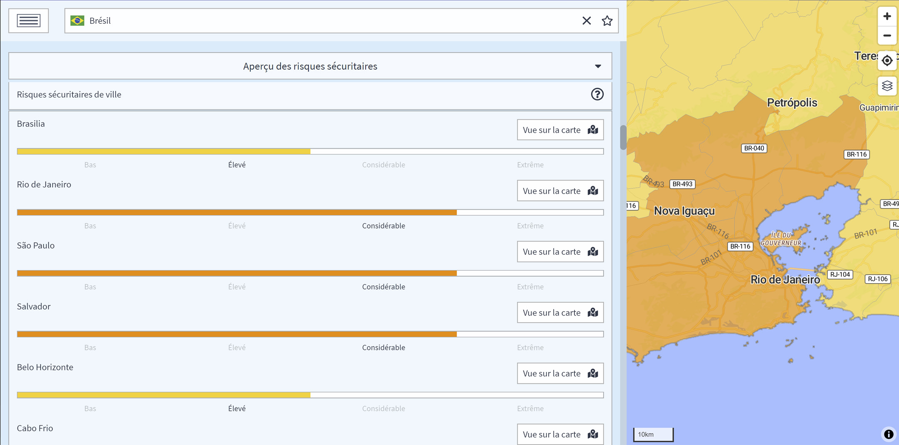

# Aperçu des risques

Gagnez une meilleure compréhension de la situation sécuritaire d'un pays. La criminalité, les troubles civils, le terrorisme, les risques généraux et la gouvernance sont autant de catégories clés à évaluer pour constituer un portefeuille de base des risques pays. En outre, nos experts identifient les risques urbains pour les principales villes de chaque pays et ajoutent de nouvelles informations sur une base mensuelle, révélant même les zones à éviter pour les voyageurs.

