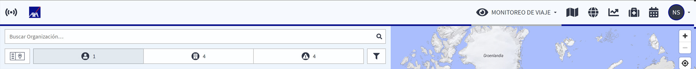

# Para Comenzar

### DESCUBRA LA PLATAFORMA

Hay varias funciones básicas que están siempre visibles en la parte superior de cada página: la **barra de navegación**, el **botón de emergencia** y, en las páginas principales, **divisor de pantalla**.

### BARRA DE NAVEGACIÓN

Para empezar a usar la plataforma pruebe la barra de navegación. Clique/toque el icono correspondiente y vaya directamente en la **Función de Botón de Emergencia/Registro**, **el Monitoreo de Viaje,** **el Mapa de Riesgo**, **los Eventos Globales**, **la Información por País** y también las opciones de **Registrar Viaje**. Por último, puede acceder a su perfil para administrar su cuenta personal o la de otros, según sus permisos.

### BOTÓN DE EMERGENCIA Y FUNCIÓN PARA REGISTRARSE

COMPARTA SU UBICACIÓN Y HAGA UNA LLAMADA DE ASISTENCIA

En situaciones críticas, el viajero puede pulsar el botón y se conectará automáticamente con el Centro de Operaciones AXA designado. Además, se transmitirá la ubicación exacta del viajero al Centro de Operaciones. Por esta razón, aunque se interrumpa la llamada, el Centro de Operaciones sabrá la ubicación del viajero y podrá gestionar el caso como una emergencia. Esta función es todavía más importante para los viajeros que están en una situación peligrosa y no pueden hablar por teléfono. EL botón de emergencia puede servir de **alarma silenciosa**; sólo con pulsar el botón, la ubicación del viajero se transmitirá inmediatamente al Centro de Operaciones y activará los procesos de emergencia consecuentes. Para saber más sobre las opciones en cuanto a asistencia en emergencias, consulte la sección de configuración de asistencia en el capítulo de monitoreo de viaje.

REGISTRARSE

La función de registrarse es la forma más rápida y precisa para informar sobre la ubicación del viajero en la plataforma e integrar a la persona en las alertas y monitoreo de la plataforma mediante su número de teléfono y su dirección de correo electrónico en su perfil de usuario. El usuario será monitorizado en las mismas geocoordenadas de su último registro. Los gestores pueden ver al viajero y su posición en el monitoreo de viaje. Después de siete días sin actualizar la posición, se acabará el monitoreo. Esta función supone una gran ventaja en los casos en que los datos de ubicación no son muy exactos, como por ejemplo si los datos de viaje PNR sólo ofrecen la ubicación del aeropuerto de llegada. Además, si no ha habido tiempo para ningún otro registro de viaje \(calendario o registro PNR\), con sólo pulsar un botón, en poco tiempo las alertas y el monitoreo de la plataforma se ocupan del viajero.


Para saber más sobre las opciones en cuanto a asistencia en emergencias, consulte la sección de configuración de asistencia en el capítulo de monitoreo de viaje.


### DIVISOR DE PANTALLA / VISTAS

Dependiendo del tamaño de pantalla que use, hay distintos divisores de pantalla disponibles. Mientras navega por las diferentes páginas y usa la plataforma, puede ajustar la vista de la pantalla a su gusto con uno o dos clics en el icono de modo de vista, que siempre se encuentra en la parte superior izquierda de la pantalla. En todas las vistas para móvil puede cambiar de panel de navegación a vista del mapa con un clic en el icono del mapa o viceversa.

