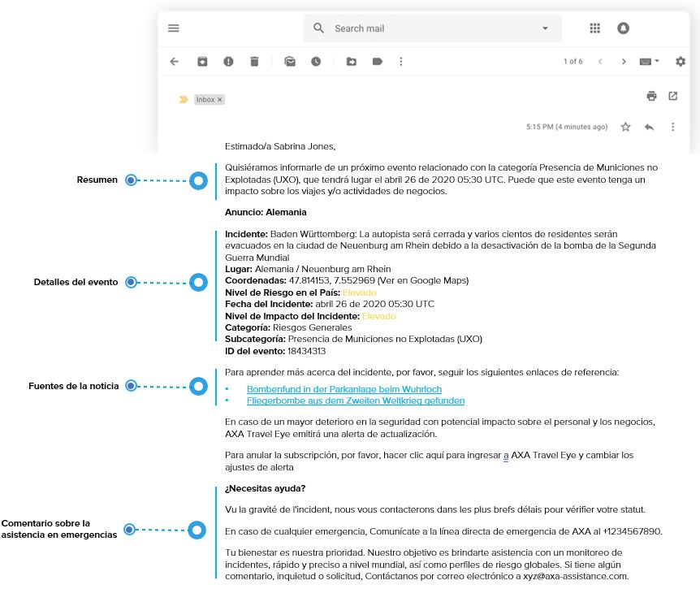

# Información de los Correos electrónicos para Eventos

## Información de Seguridad

Tenga en cuenta que se enviará información de seguridad cuando el impacto del incidente sea bajo/elevado. Se enviará una Alerta de Seguridad cuando el impacto del incidente sea alto/extremo.

## ANUNCIO

## Anuncio

