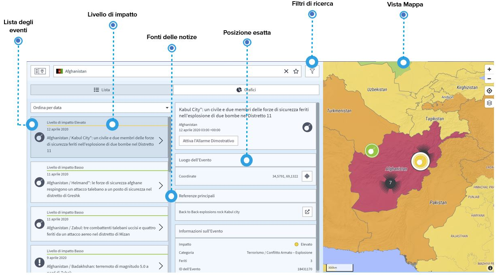

# Eventi e Incidenti

Qualsiasi evento o incidente rilevante per la sicurezza e i viaggi che è stato identificato negli ultimi anni è elencato nella **pagina degli eventi globali**.

Gli eventi elencati forniscono informazioni strutturate e comparabili come la categoria di rischio, la data e l'ora, l'impatto e l'esatta localizzazione degli incidenti, integrate da un link diretto alle fonti delle notizie. In questo modo avrete una visione d'insieme di ciò che è accaduto sul posto e potrete valutare se le misure di sicurezza o di prevenzione medica devono essere adeguate.

Inoltre, voi e i vostri viaggiatori sarete avvisati da annunci su eventi futuri, in modo da poter **ridurre al minimo il rischio e preparare il vostro personale in anticipo**.

Se siete interessati a paesi specifici, potete salvarli come preferiti e ricevere "informazioni di sicurezza" se succede qualcosa in quel paese.

Naturalmente, è necessario informarsi su luoghi, argomenti e orari specifici: **Volete sapere se i vostri viaggiatori corrono il rischio di manifestazioni violente durante il soggiorno nella capitale,** o se ci sono scontri nell'entroterra dove si trova il sito del vostro progetto, o in quali stagioni gli uragani portano inondazioni e distruzione in una specifica destinazione di viaggio? **Indirizzate la vostra ricerca in base alle vostre domande specifiche** utilizzando e combinando le molteplici opzioni di filtro.

