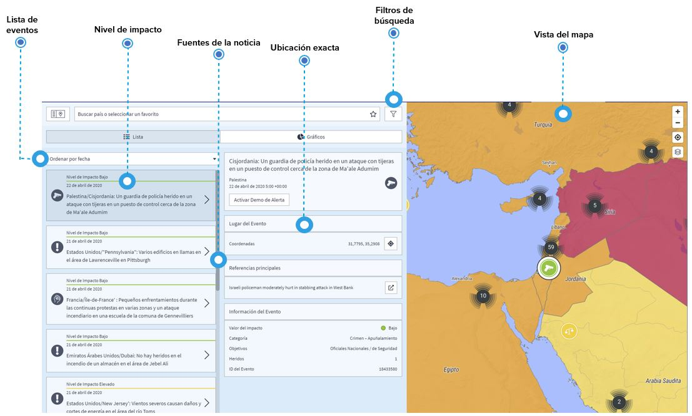

# Eventos e Incidentes

Cualquier evento o incidente con relevancia para la seguridad y el viaje que haya sido identificados en los últimos años están listados en la **página de eventos globales**.

Los eventos de la lista ofrecen información estructurada y comparable como categoría de riesgo, fecha y hora, impacto y ubicación exacta de los incidentes, además de un enlace directo a las fuentes de la noticia. De esta forma tiene una perspectiva de lo que pasé en el lugar y puede considerar si se tienen que ajustar las medidas de seguridad o de prevención médica.

Además, usted y sus viajeros serán alertados por anuncios de próximos eventos para que puedan **minimizar el riesgo y preparar al personal con antelación**.

Si está interesado en países específicos, puede guardarlos como favoritos y recibir «información de seguridad» si ocurriera algo en el país.

Obviamente, tiene que saber sobre lugares, temas o tiempos específicos: **¿Quiere saber si los viajeros se encuentran ante un peligro de manifestaciones violentas estando en la capital**, o si hay conflictos alrededor de donde se encuentra su proyecto, o en qué estaciones los huracanes provocan inundaciones y destrucción en un destino de viaje específico? **Personalice su búsqueda según sus preguntas específicas** usando y combinando las múltiples opciones de filtros.

