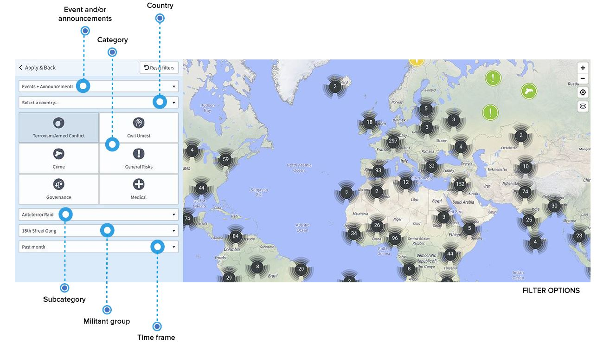

# 事件および出来事

過去数年間に確認されたセキュリティおよび渡航関連の事件および出来事は、**グローバルな事件のページ**に掲載されています。

リストアップされている事件は、ダイレクトリンクが設定されたニュースソースを参照し、リスクカテゴリー、日時、影響レベル、事件の詳細な場所などの区分で構造化され、比較可能な情報が提供されています。この方法で、現地で発生している事案についてのインサイトを把握し、セキュリティ上あるいは医療上の予防措置を講じるべきかどうかを検討することができます。

さらには、ユーザーや渡航者は、今後発生する事件に関する情報をアラートで受信するため、**リスクを最小限にとどめ、従業員に対する事前の準備を整える**ことが可能となります。

特定の国に関心がある場合、お気に入りに登録することで、事件が発生した場合に「セキュリティ情報」を受信することが可能となります。

もちろん、特定の場所、トピックおよび時間について調べる必要があります：**渡航者が首都滞在時に暴力的なデモに直面しているかどうか**、プロジェクト現場が位置する奥地で衝突が発生しているかどうか、特定の渡航先において、ハリケーンが洪水や建物への被害をもたらす時期はいつ頃なのかなどを知りたい場合があると思います。複数のフィルターオプションを使用し、組み合わせることで、**特定の質問をもとに検索対象を絞り込んでください**。

