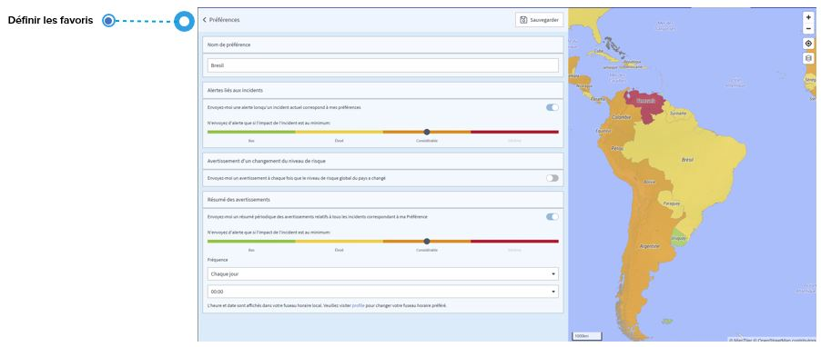

# FAQ

## Qu'est-ce qu'une annonce et une information relative à la sécurité, une alerte et une alerte spéciale ?

### **ANNONCE**

Une annonce est un incident lié à la sécurité auquel on peut s'attendre à l'avenir, comme des grèves ou des manifestations.

### INFORMATIONS RELATIVES À LA SÉCURITÉ

Une information relative à la sécurité/alerte est une information sur un incident que vous recevez par courrier électronique lorsque vous définissez un favori sur la page des événements mondiaux ou pour un pays spécifique sur la page des risques pays. Lorsque le système détecte un incident qui correspond à votre favori, vous recevez un courrier électronique contenant des informations sur l'incident.

De plus, vous pouvez programmer un **résumé d'alertes périodique** de tous les événements qui correspondent à ce favori.

### ALERTE

Les alertes sont liées aux paramètres moniteur de voyage et non aux favoris des événements mondiaux. Une alerte est un e-mail sur un incident qui a des effets possibles sur les voyageurs, les sites ou l'activité professionnelle. Les alertes sont liées à un voyageur spécifique ou à l'emplacement du site d'une entreprise. Pour chaque incident qui déclenche une alerte, le système envoie différents e-mails ; l'un est fait pour le voyageur, l'autre pour le chargé de dossier.

### **ALERTE SPÉCIALE**

Les alertes spéciales sont liées aux paramètres moniteur de voyage. En cas d'alerte spéciale, il n'est pas exclu qu'un voyageur soit directement touché par un incident de sécurité qui peut constituer une menace pour sa vie et sa santé. La plateforme contacte directement les voyageurs concernés par téléphone afin de savoir s'ils vont bien. De plus, le voyageur reçoit par courrier électronique des informations sur l'incident, notamment des directives de comportement visant à réduire le risque à proximité de l'événement. Pour chaque incident qui déclenche une alerte spéciale, le système envoie différents e-mails ; l'un est fait pour le voyageur, l'autre pour le chargé de dossier. Les courriers électroniques contiennent des mises à jour permanentes sur la situation.

