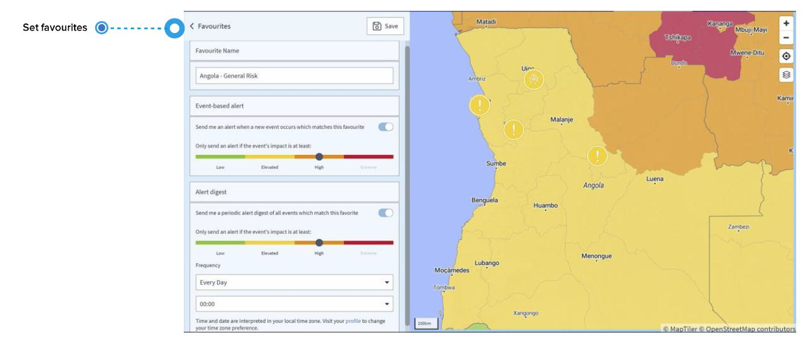

# よくある質問

## 通知、セキュリティ情報、アラートおよび特別なアラートとは何ですか？

### **通知**

通知とは、ストやデモなど、今後発生が見込まれるセキュリティ関連の事件を伝達するものです。

### セキュリティ情報

セキュリティ情報/アラートは、グローバルな事件のページでお気に入り設定を行うか、カントリーリスクページで特定の国を設定した場合に、電子メールで受信する事件情報を指します。ユーザーのお気に入り情報に合致する事件をシステムが検出した際に、事件情報に関する電子メールを受信することになります。 

さらに、お気に入りに合致する全ての事件に関する**定期的なアラートダイジェスト**の受信設定を行うこともできます。

### アラート

アラートはトラベルモニターの設定と結びついており、グローバルな事件のお気に入り登録とは結びついていません。アラートとは、渡航者、サイトおよび事業活動に影響を及ぼす可能性がある事件を伝える電子メールです。 アラートは、特定の渡航者あるいは会社施設の場所に関連するものです。アラート対象の事件ごとに、システムは異なる電子メールを送信します。1つは渡航者向け、もう1つは管理者向けの内容となっています。

### **特別なアラート**

特別なアラートは、トラベルモニターの設定と結びついています。特別なアラートが発信される際には、渡航者が生命や健康に脅威をもたらす治安事件によって、直接的な影響を受けている可能性は否定できません。本プラットフォームは、渡航者の状況を把握するために、影響を受けている渡航者に対して、直接電話で連絡を取ります。さらに、渡航者は事件がもたらすリスクを低減するための行動ガイドラインを含む、事件の情報を電子メールで受信します。特別なアラートの対象となる事件ごとに、システムは異なる電子メールを送信します。1つは渡航者向け、もう1つは管理者向けの内容であり、継続的な更新情報が含まれています。

