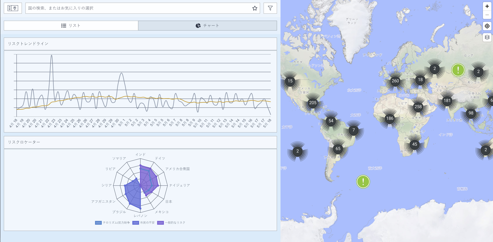

# 多画面表示

必要な情報をより直感的に入手するために、本プラットフォームは**事件を多画面で表示**します。

画面左側のリストビューでは、日付かインパクトかの選択された順序で事件（必要に応じて絞り込み可能）を閲覧することが可能です。チャートビューに変更することで、同じ事件がリスクトレンドラインおよびリスクロケーター内に表示されます。 これらのチャートを活用することで、**全体的なリスクトレンドや主要なリスク発生地**を特定することが可能となります。さらには、マップや画面の隅にある**多層マップ機能**を用いて事件を確認し、必要な情報を入手することも可能です。

