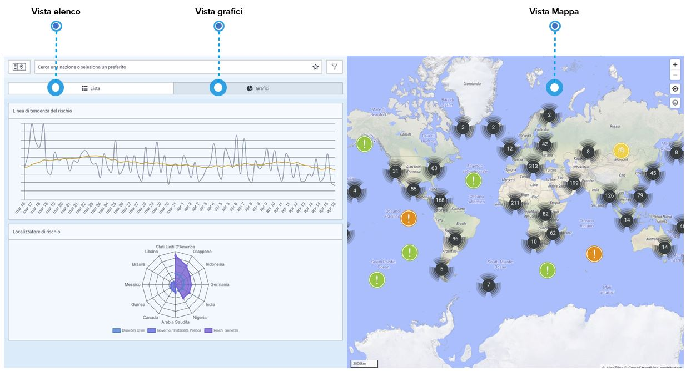

# Molteplici Viste

Per rendere più intuitiva la ricerca di ciò di cui avete bisogno, la piattaforma fornisce **molteplici modalità di visualizzazione degli eventi**.

Nella vista elenco sul lato sinistro dello schermo è possibile vedere gli eventi \(filtrati in base alle proprie esigenze\) nell'ordine specifico di scelta - per data o per impatto. Passando alla vista grafico gli stessi eventi vengono visualizzati in una linea di trend del rischio o in un localizzatore. Questi grafici vi aiutano a identificare **l'andamento generale del rischio e le aree a maggior rischio**. In alternativa, è possibile navigare attraverso gli eventi utilizzando la mappa e i suoi molteplici livelli di mappa nell'angolo dello schermo per trovare le informazioni necessarie.

