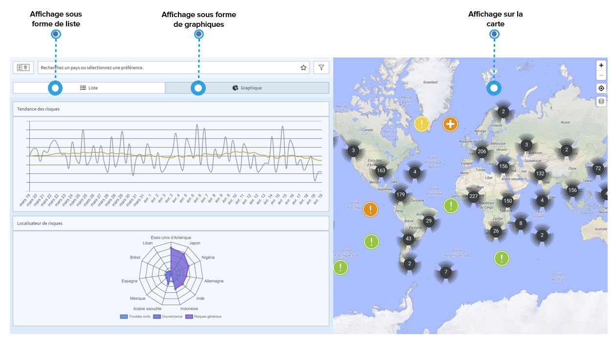

# Visualisations multiples

Pour vous permettre de trouver plus facilement ce dont vous avez besoin, la plateforme offre plusieurs **visualisations des événements**.

Dans la liste sur le côté gauche de l'écran, vous pouvez voir les événements \(filtrés selon vos besoins\) dans l'ordre spécifique de votre choix \(par date ou par impact\). Passez en mode graphique, et les mêmes événements sont affichés dans une courbe de tendance des risques ou un localisateur de risques. Ces graphiques vous aident à identifier les **tendances générales en matière de risques et les principaux lieux à risque.** Vous pouvez également naviguer à travers les événements en utilisant la carte et ses **différents calques** dans le coin de l'écran pour extraire les informations dont vous avez besoin.

