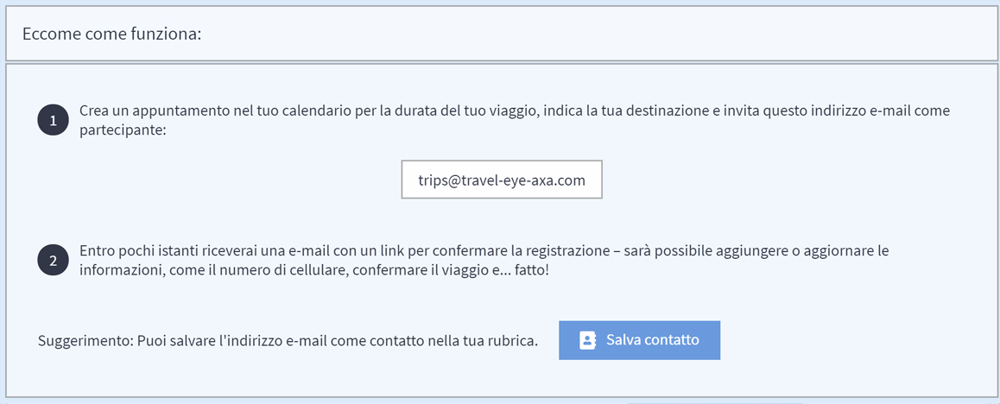

# Integrazione dei Dati di Viaggio

### PULSANTE CHECK IN NELLA BARRA DI NAVIGAZIONE

La funzione di check in nella barra di navigazione serve come il modo più breve e preciso per inviare la posizione di un viaggiatore alla piattaforma e integrare la persona, in base al numero di telefono e all'indirizzo e-mail del suo profilo utente, nel processo di monitoraggio e di allarmi della piattaforma. L'utente sarà monitorato esattamente secondo le coordinate geografiche inviate all'ultimo check in. I manager possono vedere il viaggiatore e la sua posizione nel monitor di viaggio. Dopo sette giorni senza posizione aggiornata, il monitoraggio sarà terminato. Questa funzione è un enorme vantaggio nei casi in cui i dati di posizione sono piuttosto imprecisi, ad esempio se i dati di viaggio PNR forniscono solo la posizione dell'aeroporto di arrivo. Inoltre, se non c'è stato tempo per un'altra registrazione del viaggio \(calendario o registrazione PNR\), semplicemente premendo un pulsante, il viaggiatore viene preso in carico dal sistema di monitoraggio e di allarme della piattaforma in pochi istanti.

### **REGISTRAZIONE DEL VIAGGIO DA CALENDARIO**

Molte volte i vostri viaggiatori non possono essere monitorati correttamente perché non sapete dove si trovano? Perché no? Dati di prenotazione incompleti, errori di ortografia nei nomi, numeri di telefono e indirizzi e-mail mancanti o sbagliati rendono difficile rintracciare e contattare i vostri viaggiatori. Come possiamo risolvere questo problema? Forniamo un'opzione efficiente per risolvere questo problema, tramite la registrazione del viaggio attraverso il vostro calendario personale.   
Many times, your travellers cannot be monitored properly because you don’t know where they are? Why not? Incomplete booking data, spelling mistakes in names, missing or wrong phone numbers and email addresses make tracking and contacting your travellers difficult. So how can we solve this problem? We provide an efficient option to solve this problem – via trip registration through your personal calendar. 

La registrazione del calendario permette ai vostri viaggiatori di invitare la piattaforma a qualsiasi appuntamento o viaggio in tutto il mondo. I viaggiatori possono invitare la piattaforma al loro soggiorno di 3 giorni in città con incontri d'affari, alla visita di un sito di progetto situato in una zona rurale ad alto rischio e anche alle brevi soste lungo la strada. La piattaforma sarà l'accompagnatore dei vostri viaggiatori e li informerà in modo proattivo in caso di incidente di sicurezza o avvierà le procedure di emergenza se li rileva in pericolo.

**Come funziona?** \(si prega di notare che il seguente testo è scritto per essere inoltrato ai viaggiatori\)

Basta registrare il viaggio attraverso la vostra applicazione di calendario personale - in ufficio con il vostro PC desktop o in viaggio con il vostro smartphone.

1. **Create un appuntamento** nel vostro calendario per tutta la durata del viaggio, date un nome alla vostra destinazione e invitate l'indirizzo e-mail specifico dell'azienda come partecipante. Troverete l'indirizzo e-mail nella piattaforma alla voce Calendario di registrazione viaggio. 
2. Entro pochi istanti riceverete un'e-mail con un link per **confermare la registrazione**. Questo link conduce ad una pagina di conferma dove è possibile aggiungere o aggiornare direttamente la propria posizione e i dettagli di contatto, come il numero di cellulare. Infine, confermate il viaggio e... fatto!


Potete anche salvare l'indirizzo e-mail nei vostri contatti.


Vantaggi del monitoraggio da calendario:

* **VELOCE - Bastano pochi passi**: ****Registra i viaggi in due semplici passi ovunque tu sia - in ufficio con il tuo PC desktop o in viaggio con il tuo smartphone. Basta creare un appuntamento per tutta la durata del viaggio, invitare la piattaforma come partecipante e confermare la registrazione del viaggio**.** 

  **FACILE - Semplicemente utilizzando il VOSTRO CALENDARIO PERSONALE:** potete registrare il vostro viaggio in modo semplice attraverso la vostra applicazione di calendario personale. La piattaforma supporta tutte le applicazioni di calendario più comuni, tra cui Outlook, iCal e Gmail.

  **FLESSIBILE - I tuoi voli cambiano? Basta modificare il vostro evento nel calendario:** Potete posticipare, prolungare o cancellare l'appuntamento nel vostro calendario in qualsiasi momento. Le vostre modifiche vengono immediatamente inoltrate alla piattaforma.


Si prega di notare che solo i viaggiatori che hanno un account sulla piattaforma, e possono quindi essere identificati, hanno il diritto di utilizzare il tracciamento da calendario..


