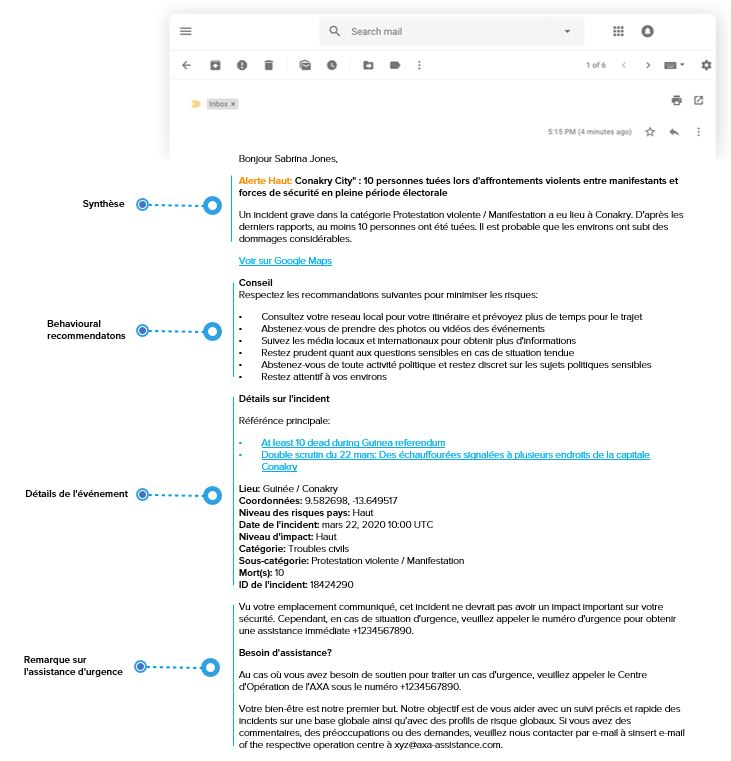

# Alertes et alertes spéciales

En sélectionnant l'aperçu des alertes, vous serez directement dirigé vers les alertes/alertes spéciales que vos voyageurs ont reçues. Pour réduire la liste des incidents affichés, vous pouvez choisir d'afficher soit les alertes, soit les alertes spéciales, définir une période donnée ou sélectionner un pays spécifique à l'aide de la barre de recherche.

Là encore, les informations que vous obtenez dans la liste sont reflétées sur la carte. Si vous sélectionnez un incident, vous aurez des informations clés à son sujet comme :

* Le titre et le pays où a eu lieu l'incident
* La catégorie/sous-catégorie de l'incident
* Le score d'impact de l'incident 
* Des références 
* Le numéro de référence de l'événement 
* Et les voyageurs concernés : cliquez sur le bouton pour afficher la liste des voyageurs concernés par l'incident, avec la possibilité d'afficher également leurs coordonnées. 


**Remarque :** Pour plus d’informations sur ce sujet, consultez la section **Paramètres alerte**.


## Exemples d'e-mails pour les alertes et les alertes spéciales

### Alerte pour le voyageur

### Alerte pour le chargé de dossier

### Alerte spéciale pour le voyageur

### Alerte spéciale pour le chargé de dossier

