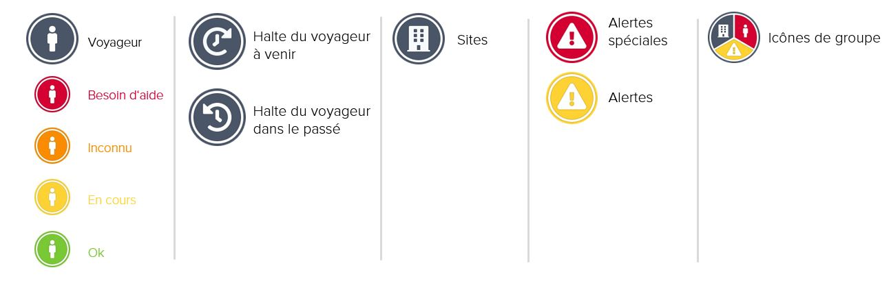

# Statut et icônes

Sur la carte du moniteur de voyage, nous utilisons les icônes suivantes.


Plusieurs voyageurs, sites et alertes au même endroit \(en fonction du niveau de zoom\) sont regroupés dans une seule icône. Cliquez sur l'icône du groupe pour séparer les informations sur chaque objet groupé.


Les icônes des voyageurs ont des couleurs différentes, en fonction de leur **situation au cours des 72 dernières heures** :

| Couleur | Statut | Description |
| :--- | :--- | :--- |

<table>
  <thead>
    <tr>
      <th style="text-align:left">Vert</th>
      <th style="text-align:left"><b>OK</b>
      </th>
      <th style="text-align:left">
        <ul>
          <li>Situation des voyageurs en r&#xE9;ponse &#xE0; l&apos;appel t&#xE9;l&#xE9;phonique
            automatique disant qu&apos;ils vont bien</li>
          <li>Situation des voyageurs par e-mail disant qu&apos;ils vont bien</li>
          <li>Indication selon laquelle le voyageur va bien, obtenue par l&apos;un des
            contacts d&apos;urgence par e-mail ou par t&#xE9;l&#xE9;phone</li>
        </ul>
      </th>
    </tr>
  </thead>
  <tbody></tbody>
</table>

<table>
  <thead>
    <tr>
      <th style="text-align:left">Jaune</th>
      <th style="text-align:left"><b>En cours</b>
      </th>
      <th style="text-align:left">
        <ul>
          <li>La s&#xE9;rie d&apos;appels t&#xE9;l&#xE9;phoniques automatique est toujours
            en cours. Aucune r&#xE9;ponse sur la situation n&apos;a encore &#xE9;t&#xE9;
            &#xE9;mise.</li>
        </ul>
      </th>
    </tr>
  </thead>
  <tbody></tbody>
</table>

<table>
  <thead>
    <tr>
      <th style="text-align:left">Orange</th>
      <th style="text-align:left"><b>Inconnu</b>
      </th>
      <th style="text-align:left">
        <ul>
          <li>Aucun statut n&apos;a &#xE9;t&#xE9; d&#xE9;tect&#xE9; jusqu&apos;&#xE0;
            ce que le dernier appel t&#xE9;l&#xE9;phonique ait &#xE9;t&#xE9; effectu&#xE9;
            (t&#xE9;l&#xE9;phone &#xE9;teint, messagerie vocale, pas de r&#xE9;ponse
            &#xE0; l&apos;appel, pas de r&#xE9;seau).</li>
          <li>Informations sur la situation par une tierce partie, autre que les voyageurs
            ou les contacts d&apos;urgence. Le prestataire d&apos;assistance d&apos;urgence
            informe les contacts d&apos;urgence, indiquant le nom et le contact de
            la tierce partie.</li>
        </ul>
      </th>
    </tr>
  </thead>
  <tbody></tbody>
</table>

<table>
  <thead>
    <tr>
      <th style="text-align:left">Rouge</th>
      <th style="text-align:left"><b>Besoin d&apos;aide</b>
      </th>
      <th style="text-align:left">
        <ul>
          <li>Informations fournies par les voyageurs sur leur situation, indiquant
            qu&apos;ils ont besoin d&apos;aide, en r&#xE9;ponse directe &#xE0; l&apos;appel
            t&#xE9;l&#xE9;phonique automatique.</li>
          <li>Le prestataire d&apos;assistance d&apos;urgence dispose d&apos;indications
            claires selon lesquelles les voyageurs concern&#xE9;s sont en danger critique
            (menace pour leur vie, leur int&#xE9;grit&#xE9; physique ou leur sant&#xE9;)
            et va lancer le processus d&apos;assistance d&apos;urgence.</li>
        </ul>
      </th>
    </tr>
  </thead>
  <tbody></tbody>
</table>

<table>
  <thead>
    <tr>
      <th style="text-align:left">Blanc</th>
      <th style="text-align:left"><b>Pas de statut</b>
      </th>
      <th style="text-align:left">
        <ul>
          <li>Les voyageurs qui n&apos;ont pas re&#xE7;u un appel t&#xE9;l&#xE9;phonique
            automatis&#xE9; de la plateforme dans les 72 derni&#xE8;res heures n&apos;ont
            pas de statut.</li>
        </ul>
      </th>
    </tr>
  </thead>
  <tbody></tbody>
</table>


Veuillez noter que les deux statuts _Inconnu_ et _Besoin d'aide_ indiquent que les voyageurs pourraient être en danger et avoir besoin d'assistance. Le prestataire d'assistance d'urgence initiera un cas d'assistance, informera le contact d'urgence et coordonnera des mesures de suivi spécifiques.


## **Comment fonctionne la plateforme et comment puis-je voir si des voyageurs sont concernés par un incident ?**

La plateforme détecte et communique automatiquement le statut des voyageurs enregistrés. Elle fonctionne de la façon suivante :

1. La plateforme constate un incident de sécurité critique, qui constitue très probablement une menace pour vos voyageurs à proximité.
2. L'incident critique déclenche une série d'appels téléphoniques automatisé et un e-mail d'alerte spéciale, en fonction de vos paramètres dans le moniteur de voyage.
3. La plateforme peut détecter trois réactions possibles aux appels téléphoniques : **OK**, **AIDE** ou **PAS DE RÉPONSE**. Le statut actuel des voyageurs est continuellement mis à jour dans le moniteur de voyage \(vert **OK**, jaune **EN COURS**, orange **INCONNU**, rouge **AIDE**\). Les statuts sont également communiqués en permanence aux destinataires du rapport par courrier électronique. S'il est nécessaire d'agir \(statut Inconnu ou Aide\), les destinataires du rapport sont en outre explicitement informés par courrier électronique.

## Puis-je vérifier le statut d'un groupe spécifique de voyageurs ?

Vous pouvez également déclencher la détection automatique du statut manuellement, sans lien avec un incident d'alerte spéciale. Dans ce cas, vous sélectionnez les voyageurs pour lesquels vous avez besoin d'un statut actualisé dans la liste des voyageurs et vous cliquez sur le bouton « Demander le statut ». La plateforme appellera les voyageurs sélectionnés et déterminera leur statut. Vous pouvez suivre les statuts mis à jour en permanence dans le moniteur de voyage \(vert OK, jaune En cours, orange Inconnu, rouge Aide\). S'il est nécessaire d'agir \(statut Inconnu ou Aide\), les destinataires du rapport sont aussi explicitement informés par courrier électronique.

