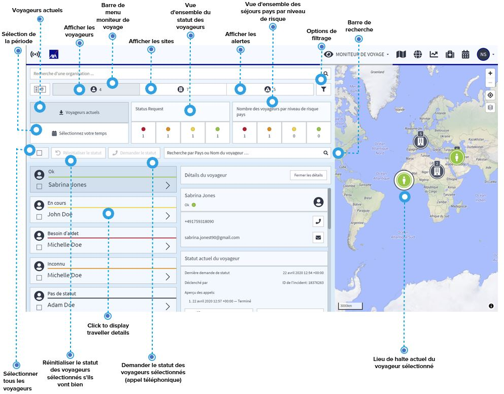

# Voyageurs

Vous pouvez avoir un aperçu complet de vos voyageurs en cliquant sur l'icône en forme de voyageur. Sur la page d'accueil du moniteur de voyage, vous pouvez voir en un coup d'œil :

* l'aperçu de la situation actuelle des voyageurs, qui indique la situation des voyageurs au cours des 72 dernières heures
* le nombre de voyageurs se trouvant dans des pays à risque faible, élevé, considérable ou extrême 

Par défaut, le système vous montre les informations relatives aux voyages en cours. Si vous avez besoin d'informations sur des voyages passés ou futurs, utilisez le bouton « Sélectionnez votre temps » et choisissez votre période. À tout moment, vous pouvez utiliser le bouton rouge pour lancer une demande de situation automatisée pour les voyageurs sélectionnés afin de connaître leur situation actuelle. Ainsi, par exemple, vous pouvez avoir une mise à jour quotidienne de la situation de vos voyageurs dans les pays à haut risque.

Cliquez sur l'icône d'un voyageur ou sur un voyageur dans la liste pour afficher les détails disponibles : les coordonnées et les emplacements des voyageurs qui sont enregistrés dans le système. La localisation des voyageurs donne des informations sur les différentes haltes et séjours du voyageur au fil du temps, notamment

* la durée de chaque halte 
* la localisation \(coordonnées et position sur la carte\) de la halte 
* les dernières informations de l'appel téléphonique sur son statut, le cas échéant

