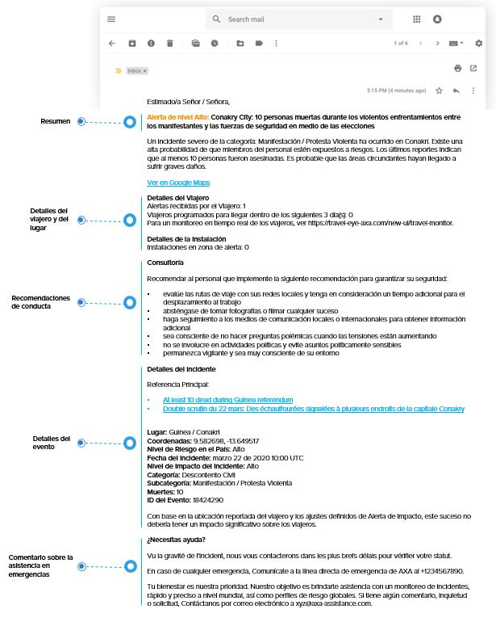

# Alertas y Alertas Especiales

Si selecciona el resumen de alertas, irá directamente a las alertas/alertas especiales que han recibido sus viajeros. Para reducir la lista de incidentes que se muestran, puede escoger si mostrar las alertas o las alertas especiales, definir un intervalo de tiempo o seleccionar un país determinado usando la barra de búsqueda.

Otra vez, la información que recibe en la lista también se muestra en el mapa. Si selecciona un incidente, recibirá la información principal sobre el incidente como por ejemplo:

* País del incidente y titular
* Categoría/subcategoría del incidente
* Valor del impacto del incidente 
* Referencias 
* ID del Evento 
* Y los viajeros afectados: clique en el botón para ver una lista de los viajeros que se han visto afectados por el incidente, con la opción de ver también su detalles de viajero. 


**Tenga en cuenta:** Para información más detallada sobre este tema, por favor consulte la sección **configuración de alertas**.


## Ejemplos de correos electrónicos de Alertas y Alertas Especiales

### Alerta para Viajero

### Alerta para Administrador

### Alerta Especial para Viajero

### Alerta Especial para Administrador

