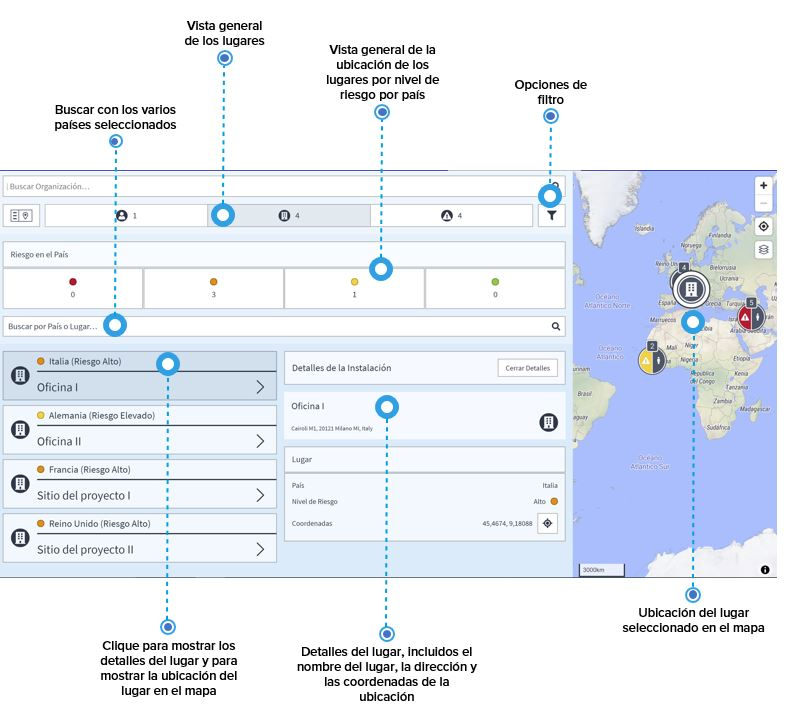

# Lugares

¿Cómo obtener una vista general de sus lugares? Clique el botón lugares en el menú del Monitoreo de Viaje para mostrar una lista de los lugares y de la ubicación de las oficinas de su empresa, si las ha introducido. Utilice la barra de búsqueda para encontrar un lugar específico. Puede buscar el nombre de un lugar o buscar por país/países para mostrar varios lugares que se encuentren en estos países.

Clique el icono de un lugar en el mapa o un lugar en la lista para mostrar los detalles disponibles: la dirección del lugar y las coordenadas exactas de su ubicación.

### Administración del Sitio - ¿Cómo puedo incorporar los sitios de la empresa?

Si clica en el icono Monitoreo de Viaje en la barra de navegación, escoja administración del sitio para acceder al panel de edición.

Si ya había incorporado otros emplazamientos de la empresa, puede editar-los o borrarlos con sólo clicar la flecha en la parte derecha de la lista de entrada para el sitio que quiera editar.

Puede agregar un nuevo emplazamiento de oficinas o un lugar de proyecto si pulsa el botón + agregar sitio. Use la barra de búsqueda en el mapa para localizar su sitio importante y use el marcador para establecer la ubicación exacta. Ponga un nombre al sitio y pulse el botón verde de guardar. Aparecerá el mensaje «sitio agregado correctamente» de color verde.

