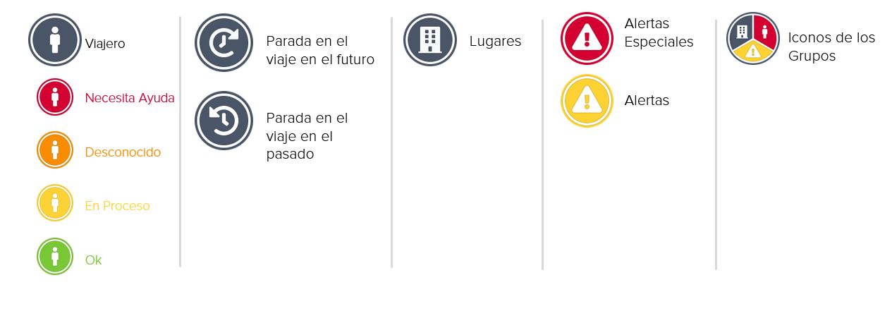

# Estado e Iconos

En el mapa del monitoreo de viaje utilizamos los siguientes iconos.


Si hay varios viajeros, lugares y alertas en una misma ubicación \(dependiendo del nivel de zoom\), se agrupan en un icono. Clique el icono del grupo para separar la información de cada objeto agrupado.


Los iconos de los viajeros tienen distintos color, dependiendo de su **estado en las últimas 72 horas**:

| Color | Estado | Descripción |
| :--- | :--- | :--- |

<table>
  <thead>
    <tr>
      <th style="text-align:left">Verde</th>
      <th style="text-align:left"><b>Ok</b>
      </th>
      <th style="text-align:left">
        <ul>
          <li>Confirmaci&#xF3;n de estado por los viajeros como respuesta a la llamada
            de estado automatizada de que est&#xE1;n bien</li>
          <li>Confirmaci&#xF3;n de estado por los viajeros por correo electr&#xF3;nico
            o tel&#xE9;fono de que est&#xE1;n bien</li>
          <li>Confirmaci&#xF3;n de estado de que el viajero est&#xE1; bien mediante
            uno de los contactos de emergencia por correo electr&#xF3;nico o tel&#xE9;fono</li>
        </ul>
      </th>
    </tr>
  </thead>
  <tbody></tbody>
</table>

<table>
  <thead>
    <tr>
      <th style="text-align:left">Amarillo</th>
      <th style="text-align:left"><b>En Proceso</b>
      </th>
      <th style="text-align:left">
        <ul>
          <li>El conjunto de llamadas de estado autom&#xE1;ticas todav&#xED;a no ha
            terminado. Todav&#xED;a no ha habido confirmaci&#xF3;n de estado.</li>
        </ul>
      </th>
    </tr>
  </thead>
  <tbody></tbody>
</table>

<table>
  <thead>
    <tr>
      <th style="text-align:left">Naranja</th>
      <th style="text-align:left"><b>Desconocido</b>
      </th>
      <th style="text-align:left">
        <ul>
          <li>No se detect&#xF3; ning&#xFA;n estado hasta que se termin&#xF3; la &#xFA;ltima
            llamada de estado (tel&#xE9;fono apagado, buz&#xF3;n de voz, llamada no
            contestada, sin conexi&#xF3;n).</li>
          <li>Confirmaci&#xF3;n de estado por otra persona que no son ni los viajeros
            ni los contactos de emergencia. El proveedor de asistencia en emergencias
            informa a los contactos de emergencia, con el nombre y el contacto de la
            otra persona.</li>
        </ul>
      </th>
    </tr>
  </thead>
  <tbody></tbody>
</table>

<table>
  <thead>
    <tr>
      <th style="text-align:left">Rojo</th>
      <th style="text-align:left"><b>Necesita Ayuda</b>
      </th>
      <th style="text-align:left">
        <ul>
          <li>Confirmaci&#xF3;n de estado por los viajeros de que necesitan ayuda como
            respuesta directa a la llamada de estado autom&#xE1;tica.</li>
          <li>El proveedor de asistencia en emergencia tiene una indicaci&#xF3;n clara
            de que los viajeros afectados est&#xE1;n en peligro cr&#xED;tico (amenaza
            para la vida, la integridad f&#xED;sica o la salud) y comenzar&#xE1; el
            proceso de asistencia en emergencias.</li>
        </ul>
      </th>
    </tr>
  </thead>
  <tbody></tbody>
</table>

<table>
  <thead>
    <tr>
      <th style="text-align:left">Blanco</th>
      <th style="text-align:left"><b>Sin Estado</b>
      </th>
      <th style="text-align:left">
        <ul>
          <li>Viajeros que no han recibido ninguna llamada de estado automatizada desde
            la plataforma en las &#xFA;ltimas 72 horas no tienen estado.</li>
        </ul>
      </th>
    </tr>
  </thead>
  <tbody></tbody>
</table>


Tenga en cuenta que ambos estado _Desconocido_ y _Necesita Ayuda_ indican que el viajero podría estar en peligro y necesitar asistencia. El proveedor de asistencia en emergencias comenzará un caso de asistencia, informará al contacto de emergencia y coordinará las medidas de seguimiento específicas.


## **¿Cómo funciona la plataforma y cómo puedo ver si los viajeros están afectados por un incidente?**

La plataforma detecta el estado de los viajeros registrados automáticamente y comunica su estado. Funciona de la siguiente manera:

1. La plataforma encuentra un incidente de seguridad crítico, que muy probablemente representa una amenaza para sus viajeros en los alrededores.
2. El incidente crítico activa un conjunto de llamadas de estado automatizadas y un correo electrónico de alerta especial, según su configuración individual en el monitoreo de viaje.
3. La plataforma puede detectar tres confirmaciones posibles de la llamada de estado: **OK**, **AYUDA** o **SIN RESPUESTA**. El estado actual de los viajeros se actualiza continuamente en el monitoreo de viaje \(verde **OK**, amarillo en **PROCESO**, naranja **DESCONOCIDO**, rojo **AYUDA**\). Los estados también se comunican continuamente a los receptores del informe por correo electrónico. Si hubiera necesidad de actuar \(estado Desconocido o Ayuda\), los receptores del informe son informados, adicionalmente, por correo electrónico de forma explícita.

## ¿Puedo comprobar el estado de un grupo de viajeros específico?

También puede activar la detección de estado automatizada manualmente, aunque no haya conexión con un incidente de alerta especial. En este caso, usted selecciona los viajeros de los que necesita un estado actualizado en la lista de viajeros y clica el botón «solicitar estatus». La plataforma llamará a los viajeros seleccionados y determinará su estado. Puede hacer un seguimiento de los estados que se actualizan continuamente en el monitoreo de viaje \(verde Ok, amarillo en Proceso, naranja Desconocido, rojo Ayuda\). Si hubiera necesidad de actuar \(estado Desconocido o Ayuda\), los receptores del informe también son informados por correo electrónico de forma explícita.

