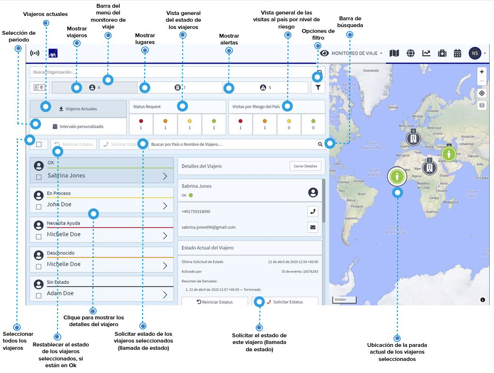

# Viajeros

Puede obtener una vista general completa de sus viajeros con un solo clic en el icono viajeros. En la página de inicio del Monitoreo de Viaje puede ver con un solo vistazo:

* una vista general del estado actual de los viajeros, que también muestra su estado en las últimas 72 horas
* el número de viajeros que se encuentran en países con riesgo bajo, elevado, alto y extremo 

Por defecto, el sistema le muestra la información de los viajes actuales. Si quiere saber sobre los viajes pasados o futuros, utilice el botón intervalo personalizado y seleccione el periodo que desee. Puede usar el botón rojo cuando quiera para iniciar una solicitud de estado automatizada para viajeros seleccionados para saber su estado actual. De esta forma, por ejemplo, puede tener una actualización diaria del estado de sus viajeros en países con riesgo alto.

Clique el icono de un viajero o un viajero en la lista para mostrar los detalles disponibles: los detalles de contacto y la ubicación de los viajeros que están registrados en el sistema. La ubicación de los viajeros muestra información de las distintas paradas y estadías del viajero con el tiempo, incluido

* la duración de cada parada 
* la ubicación \(coordenadas y posición en el mapa\) de la parada 
* la información de la última llamada de estado, si hubiera

