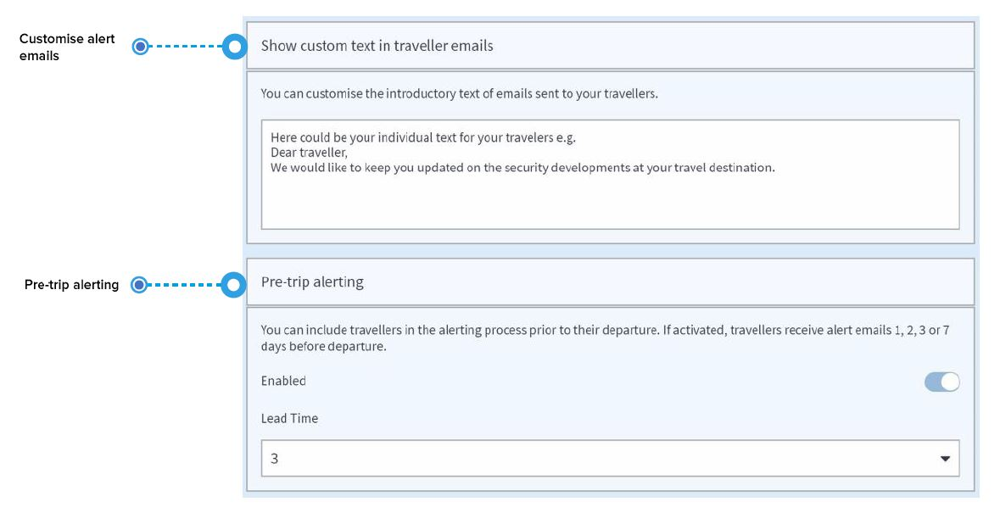
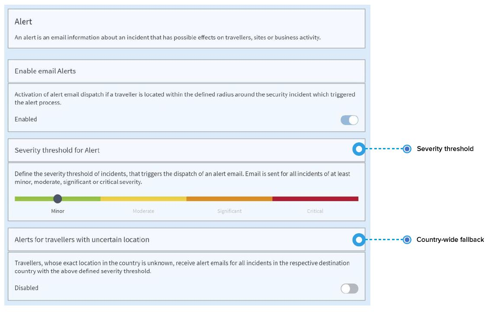
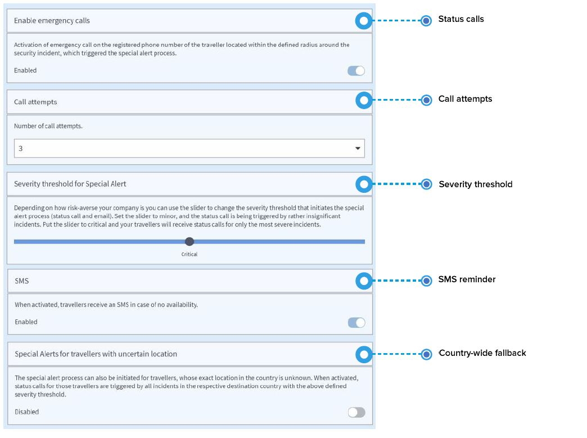

# Alerta

### ¿Qué es la «Alerta»?

La Alerta es un concepto global para alertas y alertas especiales y los procedimientos para comunicar su seguimiento:

1. **Alerta:** información por correo electrónico sobre un incidente que tiene posibles efectos sobre los viajeros, los lugares o la actividad comercial. 
2. **Alerta especial:** información por correo electrónico sobre un incidente crítico de seguridad que ocurra cerca de los viajeros y, por lo tanto, pueda afectar al personal, los lugares o la actividad comercial. El mismo correo electrónico también incluye pautas de conducta para viajeros que se encuentren cerca de un incidente de este tipo. Lo más importante es que una **alerta especial inicia inmediatamente una serie de llamadas de estado automatizadas** a los viajeros que hayan podido verse afectados y saber si están bien o necesitan asistencia.

## ¿Qué es la configuración general?

Personalice correos electrónicos de alerta y use alertas previas al viaje.

* Para empezar, puede **personalizar el texto de introducción de los correos electrónicos de alerta** que se envían a sus viajeros para que los identifiquen como un mensaje fiable de parte de su empleador/empresa. Por ejemplo: _Este correo electrónico ha sido enviado en nombre de SU EMPRESA. Queremos que esté seguro y al día durante sus viajes. Por favor, lea atentamente..._ 
* Puede incluir a los viajeros en el **proceso de alerta antes de su salida**. Estando activo, los viajeros recibirán correos electrónicos de alerta 24h, 48h, 72h o 7 días antes de la salida. Suele ser útil estar informado de lo que pasa en el país antes de partir para prepararse en consecuencia, por ej., reprogramar el acto de bienvenida.

## ¿Cómo habilito el \(correo electrónico\) de alerta?

Una alerta es una información por correo electrónico sobre un incidente que tiene posibles efectos sobre los viajeros, los lugares o la actividad comercial. Si activa la alerta, la siguiente configuración se aplicará en su empresa.

**¿Qué es el umbral de alerta?** Puede establecer el umbral de gravedad para incidentes que activen el envío de correos electrónicos de alerta. Según donde sitúe el deslizador, los destinatarios del informe y sus viajeros recibirán correos electrónicos de alerta para incidentes de al menos gravedad **menor, moderada, significativa o crítica**.


Si quiere alertar a los viajeros solamente de los incidentes más graves, sitúe el deslizador en crítico. Si prefiere información sobre seguridad más amplia, sitúe el deslizador en moderado.


## ¿Cómo preparo el \(correo electrónico y la llamada de estado\) de alerta especial?

La alerta especial se activa si ocurre un incidente crítico y sus viajeros están cerca o dentro de la zona de impacto del incidente. En este caso, usted quiere saber lo antes posible si sus viajeros están bien. En caso de una alerta especial, **se llama a los viajeros afectados en su número de teléfono registrado** para saber su estado \(llamada de estado\). La plataforma sabrá si un **viajero está bien o necesita ayuda** e informará inmediatamente a los destinatarios del informe. Además de la llamada de estado, los viajeros también recibirán por correo electrónico la información del incidente con recomendaciones.

#### ¿Qué configuración puedo escoger?

* Puede establecer el número de **llamadas de estado** \(3-5\) a sus viajeros en una emergencia. A menudo los viajeros no responderán a la primera o segunda llamada inmediatamente. Si se les llama más de una vez con 5-10 minutos entre llamadas, hay más posibilidades que respondan y proporciones información de su estado. Los viajeros que no cojan el teléfono \(teléfono apagado, no respondan, no tengan conexión\) reciben el estado de «desconocido». Se informará a los contactos de emergencia y se deberá hacer un seguimiento de su estado.
* **SMS y correo electrónico de recordatorio**: Los viajeros desconocidos que no hayan respondido la llamada de estado recibirán un correo electrónico y un SMS con una petición para que proporcionen información sobre su estado. Se trata de que llamen o envíen un correo electrónico a su contacto de emergencia en cuanto reciban el mensaje. Si no quiere que se envíen un SMS además del correo electrónico, puede desactivarlo. 
* El proceso de alerta especial también puede iniciarse para los viajeros cuya **posición exacta en el país sea desconocida.**. Si se activa, se producen llamadas de estado en todos los incidentes al país de destino correspondiente que tengan la gravedad definida en el umbral.​

### ¿Cómo sé si he habilitado las Alertas y las Alertas Especiales correctamente?

Si no está seguro de su configuración o solamente siente curiosidad para saber cómo funciona la plataforma, puede comprobarlo y verlo en la sección «vista previa del radio de incidente». Como está basada en multitud de parámetros, la plataforma define dinámicamente los radios de impacto individuales para las alerta y las alertas especiales de un incidente de seguridad. Algunos de los parámetros más importantes que definen el radio son el impacto del incidente, la categoría del incidente y la confianza de ubicación del viajero.


¡Pruebe su configuración antes de empezar!


### ¿Cómo se hace?

Use el deslizador y escoja un **valor del impacto del incidente**, una **categoría del incidente** que le interese y un **nivel de confianza**: En el gráfico de más arriba puede ver como va cambiando el radio de incidente.


**Tenga en cuenta** que, por defecto, algunas categorías de incidente no activan ninguna llamada de estado por alerta especial.



**Nota sobre la confianza de ubicación del viajero:** Cuanto más exactos sean los datos de ubicación del viajero, de forma más precisa se puede definir el radio de incidente. Si el registro del viaje está limitado a datos sobre el vuelo, el viajero está localizado en el aeropuerto de llegada, que es un lugar de baja confianza porque es muy probable que el viajero se mueva de allí después de su llegada. Por esta razón, la plataforma dibuja un radio más grande alrededor de los incidentes. Los viajeros que usen seguimiento de calendario o GPS, en cambio, tienen una confianza de ubicación mayor, por lo que el radio alrededor de los incidentes será más pequeño y la alerta será más precisa.


