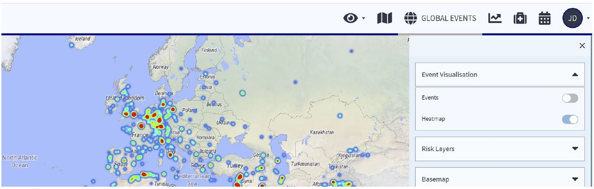

# リスクマップ

## リスクマップとは

リスクマップは、各国の動的情報を示す上で中核を担う機能です。

マップを拡大することで、国別指標よりも細かいレベルでEXOPのリスク評価を把握することが可能となります。州や県レベルでのリスクや、**都市さらには地区レベルでも**リスクが示されます。重要な都市に目を向けると、紫色で表示された地域が**渡航者にとってリスクがより高い地域**であることが明らかとなります。**マップの種類**や**レイヤー**など、異なる情報を選択して表示することも可能です。

「事件の選択」と「事件の可視化」を使用することで、関心のあるリスクカテゴリーと特定の時期の治安事件の情報をもとにした、対象地域の専門的なリスクプロファイルを作成することが可能となります。


特に調べたい内容を具体的に把握している場合は、**検索バー**を使用し、マップで確認することを推奨いたします。調べたい都市名やその他の地域名を入力するだけで操作可能です。


### ヒートマップ

**ヒートマップ**を一目見るだけで、リスクの頻発地域を把握することができます。 ユーザー自身で設定したフィルターに基づき、どの地域を避けるべきか、またどの地域でより高度な安全対策が必要となるかが示されます。3年前に深刻であった脅威が、今日まで存在しているとは限りません。そのため、時期による絞り込み機能を使用することは、**疑問に対する明確な回答を得るために不可欠**となります。

