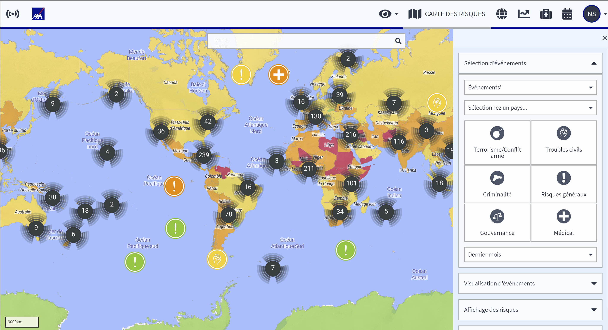

# Carte des risques

## Qu'est-ce que la carte des risques ?

La carte des risques est la clé de voûte des informations sur les risques pays dynamiques de la plateforme.

En zoomant sur la carte, on peut voir les cotes de risque EXOP même en dessous du niveau des pays. Il montre le risque des régions et des provinces, **jusqu'aux villes et même aux districts urbains**. En examinant de plus près les grandes villes, on peut voir des zones marquées en violet **qui présentent un risque plus élevé pour les voyageurs**. Vous pouvez choisir d'afficher différentes informations, **types de cartes** et **calques**.

En utilisant la sélection et la visualisation des événements, vous pouvez générer un profil de risque professionnel d'une région basé sur les incidents de sécurité dans les catégories de risque qui vous intéressent et sur une période donnée.


Il est conseillé de naviguer sur la carte à l'aide de la **barre de recherche**, surtout si vous savez exactement ce que vous cherchez. Il suffit d'entrer le nom de la ville ou de l'endroit que vous souhaitez examiner.


### CARTE DE CHALEUR

En un seul coup d'œil, la **carte de chaleur** vous montre les zones à risque. Définie par vos filtres, elle vous indique les zones à éviter et celles qui nécessitent des mesures de sécurité plus strictes. Une menace qui était très forte il y a trois ans ne doit pas nécessairement être présente aujourd'hui, c'est pourquoi il est **impératif d'utiliser le filtre temporel pour obtenir une réponse claire à vos questions.**

