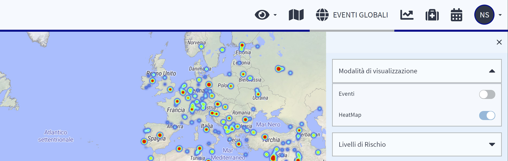

# Mappa del Rischio

## COS'È LA MAPPA DEL RISCHIO?

La Mappa dei rischi è il cuore delle informazioni dinamiche sui paesi.

Lo zoom sulla mappa rivela le classificazioni dei rischi di AXA anche al di sotto del livello del paese. Mostra il rischio delle amministrazioni e delle province, **fino alle città e persino ai distretti cittadini.** Osservando più da vicino le città più importanti, si possono vedere contrassegnate dal colore viola **le aree a rischio più elevato per i viaggiatori**. È possibile selezionare e visualizzare diverse informazioni, **tipi di mappe** e **livelli**. 

Utilizzando la selezione degli eventi e la visualizzazione degli eventi, è possibile generare un profilo di rischio professionale di una regione in base agli incidenti di sicurezza nelle categorie di rischio di vostro interesse e in un certo lasso di tempo.


Si ****consiglia di  utilizzare la **barra di ricerca** per navigare la mappa, soprattutto se si sa esattamente cosa si sta cercando. Basta inserire il nome della città o di un altro luogo che si desidera cercare.


### MAPPA DI CALORE

A colpo d'occhio, la **mappa del calore** mostra i punti caldi di rischio. Definita dai vostri filtri, vi mostra quali aree devono essere evitate e quali aree richiedono misure di sicurezza più elevate. Una minaccia che tre anni fa era acuta non deve necessariamente essere presente oggi, per questo motivo l'utilizzo del filtro temporale è **indispensabile per ottenere una risposta chiara alle vostre domande.**

