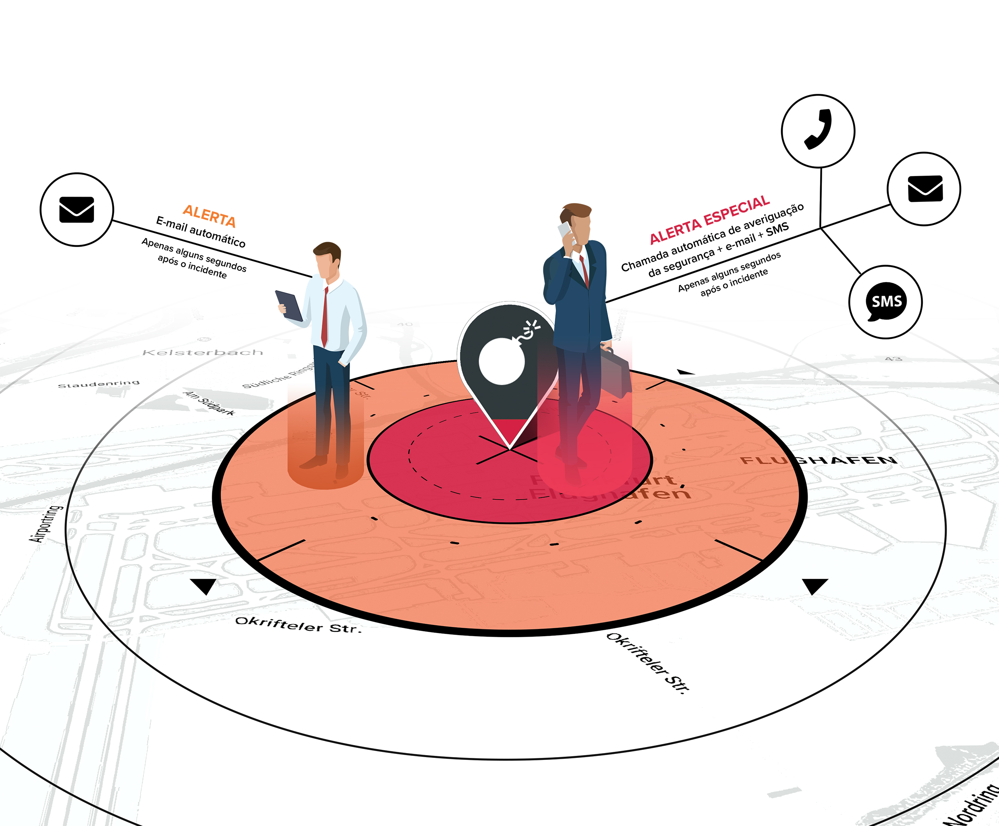

# Panoramica del Prodotto

### VIDEO INTRODUTTIVO



### PANORAMICA DEL PRODOTTO

Travel Eye è una **piattaforma di gestione del rischio di mobilità** che rileva gli incidenti di sicurezza 24 ore su 24, 7 giorni su 7, in tutto il mondo e fa corrispondere la posizione di un incidente con il luogo in cui si trovano i vostri viaggiatori per avvisare automaticamente i viaggiatori che si trovano nelle vicinanze dell'incidente.

In soli 2 minuti, Travel Eye vi dice se i vostri viaggiatori stanno bene o se hanno bisogno di aiuto. La piattaforma consente inoltre di effettuare chiamate di emergenza, informazioni sulla posizione in caso di emergenza \(se consentito\), richieste di informazioni mirate sullo stato.

### FUNZIONI CHIAVE

In breve, Travel Eye Platinum:

* Identifica e riduce al minimo i rischi di viaggio
* Integra i dati di viaggio e mappa la posizione dei viaggiatori e dei siti
* Trova rapidamente gli incidenti di sicurezza rilevanti con l'aiuto dell'intelligenza artificiale
* Confronta i dati di viaggio con il luogo di un incidente di sicurezza in pochi secondi
* Chiede in modo proattivo lo stato dei viaggiatori avvisati e trasmette lo stato alla direzione
* Comunica nella lingua con cui i vostri dipendenti si sentono a proprio agio
* Avvisa automaticamente i responsabili in caso di necessità di supporto e attiva automaticamente le misure di supporto d'emergenza

### OBIETTIVI DI QUESTE LINEE GUIDA

La seguente guida descrive le funzioni e le caratteristiche più importanti di Travel Eye Platinum, la piattaforma di Mobility Risk Management. La guida è scritta principalmente per gli amministratori e i gestori della piattaforma, ma può essere utile anche per gli utenti con autorizzazioni meno estese. Dopo ogni sezione troverete delle FAQ che vi aiuteranno a rispondere direttamente alle vostre domande.


**Nota bene:** questa è una guida per l'utente e non fornisce una descrizione tecnica dettagliata del processo di allerta della piattaforma o delle procedure di bordo/autenticazione/login.


