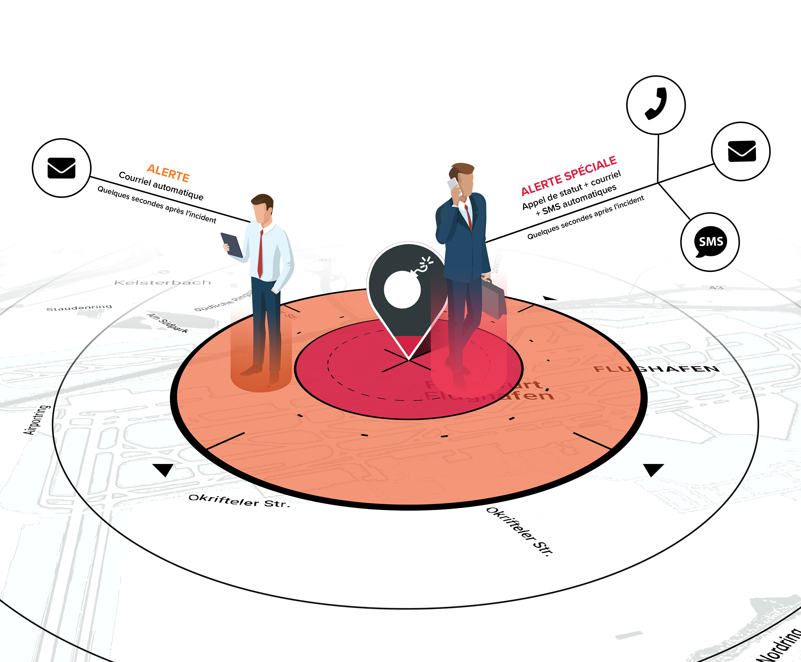

# Présentation du produit

## VIDÉO D'INTRODUCTION



## PRÉSENTATION DU PRODUIT

Travel Eye est une **plateforme de gestion des risques liés à la mobilité** qui identifie les incidents de sécurité dans le monde entier 24 heures sur 24, 7 jours sur 7, fait correspondre le lieu des incidents avec les données de réservation de voyage de votre entreprise et appelle automatiquement vos voyageurs s'ils se trouvent dans un certain rayon d'impact d'un incident.

En seulement 2 minutes, Travel Eye est capable de vous dire si tous vos voyageurs vont bien ou s'ils ont besoin d'aide. La plateforme permet également d'effectuer des appels d'urgence, de partager des emplacements \(si cela est autorisé\) en cas d'urgence et de demander si une personne va bien.

## PRINCIPALES FONCTIONNALITÉS

En résumé, Travel Eye :

* Identifie et minimise les risques liés aux voyages
* Intègre les données relatives aux voyages et cartographie la localisation des voyageurs et des sites 
* Trouve rapidement les incidents de sécurité pertinents grâce à l'intelligence artificielle
* Fait correspondre la localisation des voyageurs et des sites avec les incidents de sécurité en cours en quelques secondes
* Demande de manière proactive si les voyageurs qui ont reçu des alertes vont bien et informe les responsables
* Communique dans la langue avec laquelle vos employés se sentent à l'aise
* Alerte le responsable si une assistance est nécessaire et déclenche automatiquement des mesures de soutien d'urgence

## INTENTION DE CE GUIDE

Le guide suivant vise à décrire les principales fonctions et caractéristiques de Travel Eye, la plateforme de gestion des risques liés à la mobilité. Il est principalement écrit pour les administrateurs et les chargés des dossiers de la plateforme, mais peut également être utile pour les utilisateurs qui ont des autorisations moins étendues. Après chaque section, vous trouverez des FAQ qui pourraient répondre directement à vos questions.


**Remarque** : ceci est un guide de l'utilisateur qui ne fournit pas une description technique détaillée du processus d'alerte de la plateforme ou des procédures de mise en route/d'authentification/de connexion.


