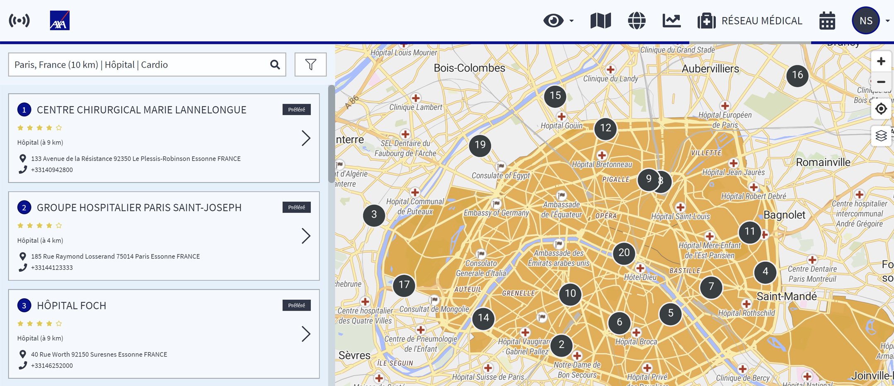

# Réseau médical

## Trouver les meilleurs prestataires médicaux

La page du réseau médical comprend une longue liste de prestataires médicaux que vous pouvez sélectionner à l'aide de filtres. Commencez par sélectionner le lieu où vous recherchez un prestataire médical ou un hôpital et entrez une catégorie ou une spécialité médicale. Pour recevoir les résultats, cliquez à chaque fois sur « Appliquer ».

Les résultats vous fourniront une liste d'hôpitaux qui sera également visualisée sur la carte. Vous pouvez cliquer sur les icônes de la carte pour obtenir plus d'informations.

Pour sélectionner de façon plus fine, par exemple avec la langue ou les jours d'ouverture, utilisez l'option de filtrage.

Pour voir les résultats, sélectionnez « Appliquer » et revenez en arrière.

