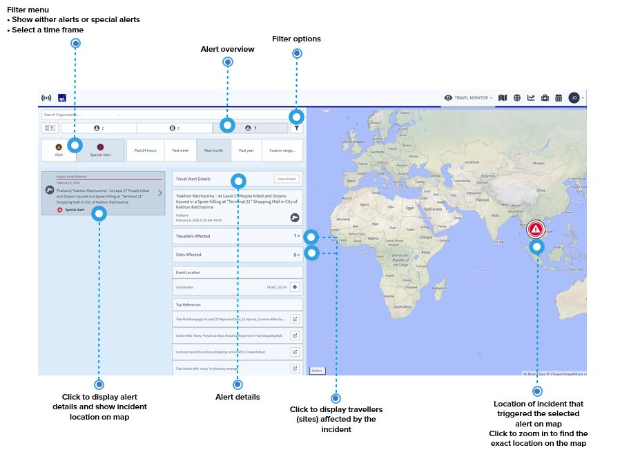
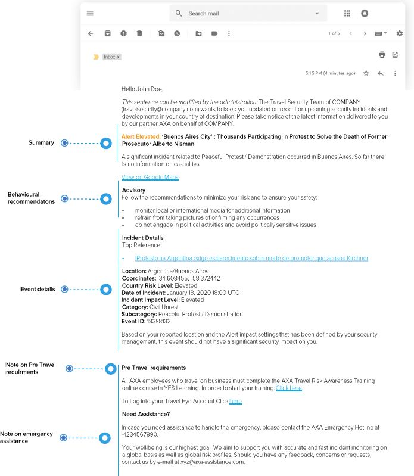
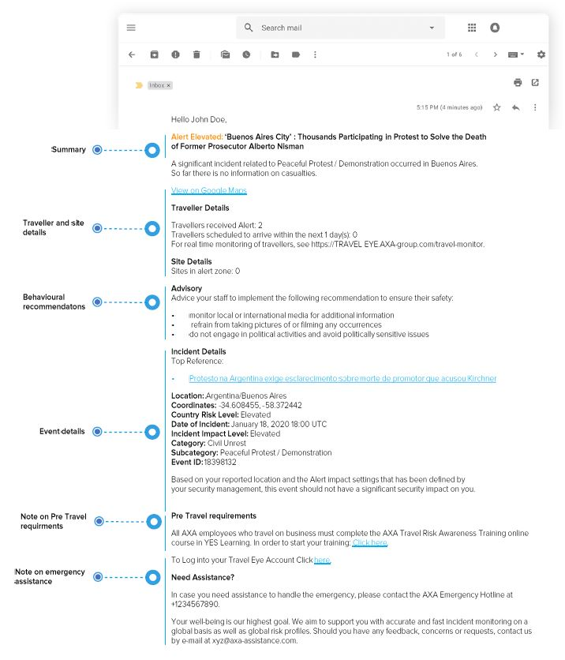
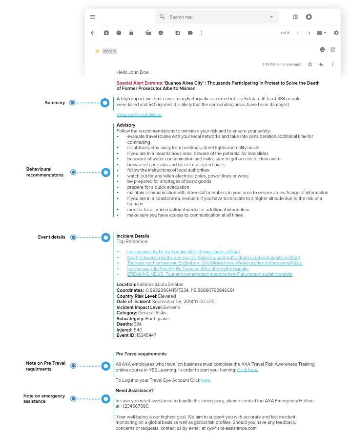
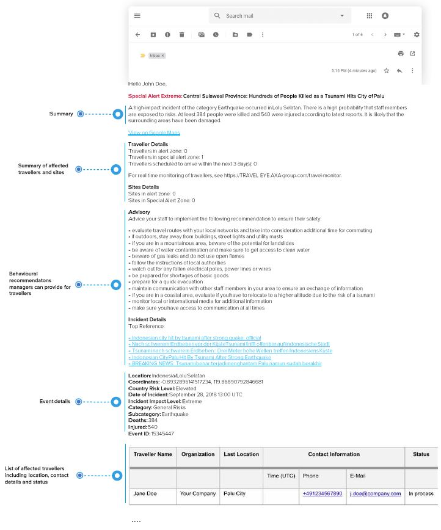

# アラートおよび特別なアラート

アラート概要を選択すると、渡航者が受信したアラートおよび特別なアラートへと直接移動します。リストで表示される事件を減らすには、アラートか特別なアラートかを選択するか、特定の時期を選択するか、検索バーで特定の国を入力してください。

また、リストで取得する情報は、マップ上にも反映されています。事件を選択すると、以下の主要な情報を入手することができます：

* 事件発生国およびヘッドライン
* 事件カテゴリー/サブカテゴリー
* 事件インパクトスコア
* リファレンス 
* 事件 ID 
* 影響を受けている渡航者: ボタンをクリックすれば、事件の影響を受けている渡航者のリストが表示されます。オプションで渡航者の詳細を表示することも可能です。


**注意事項:** このトピックに関する詳細情報は、**アラート設定**のセクションを参照してください。


## アラートおよび特別なアラートの電子メール例

### 渡航者向けのアラート

### 管理者向けのアラート

### 渡航者向けの特別なアラート

### 管理者向けの特別なアラート

