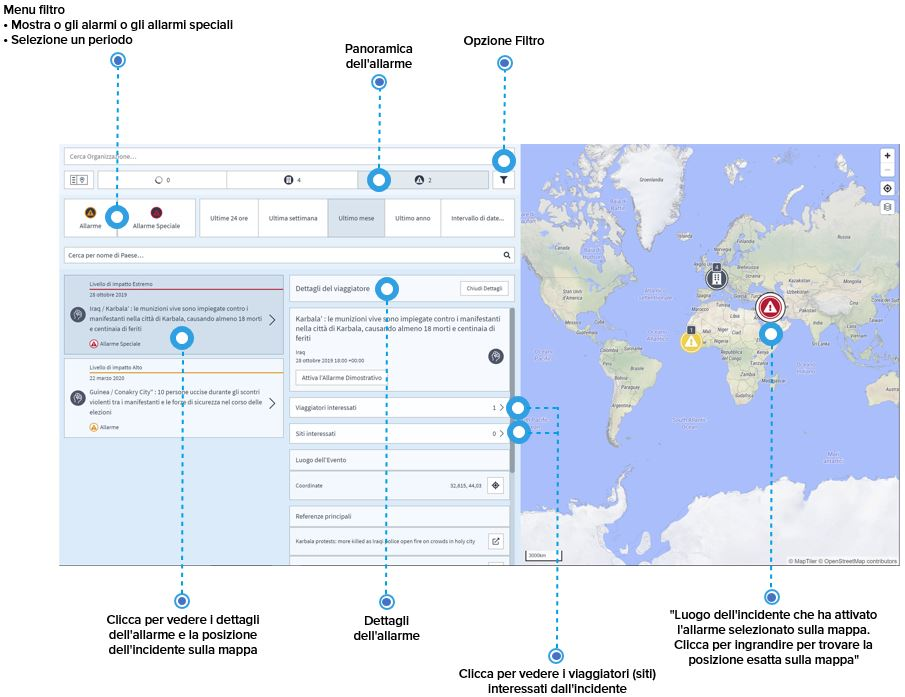
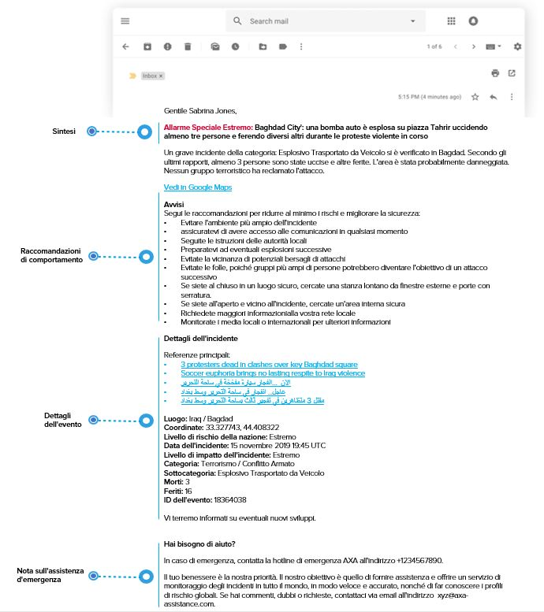
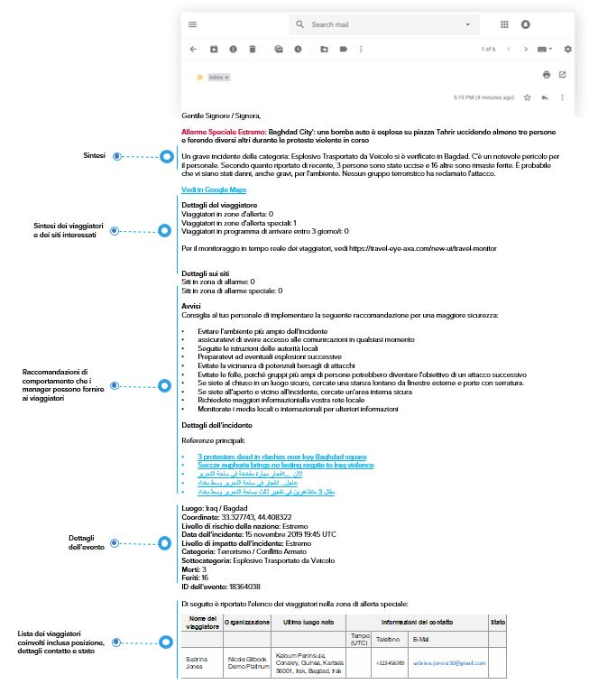

# Allarmi e Allarmi Speciali

Selezionando la panoramica degli allarmi si accede direttamente agli allarmi/allarmi speciali che i viaggiatori hanno ricevuto. Per ridurre l'elenco degli incidenti visualizzati, potete scegliere di visualizzare solo gli allarmi o gli allarmi speciali, definire un determinato periodo di tempo o selezionare un paese specifico tramite la barra di ricerca.

Anche in questo caso, le informazioni che otterrete nell'elenco si rispecchiano sulla mappa. Selezionando un incidente si ottengono informazioni chiave sull'incidente, come ad esempio:

* Paese dell'incidente e titolo
* Categoria/sottocategoria di incidente
* Impatto dell'incidente 
* Riferimenti 
* ID dell'Evento
* E i viaggiatori coinvolti: cliccate sul pulsante per visualizzare l'elenco dei viaggiatori interessati dall'incidente, con la possibilità di visualizzare anche i dettagli dei viaggiatori. 


**Nota bene:** per informazioni più dettagliate su questo argomento, consultare la sezione **impostazioni degli allarmi**.


## Esempi di E-mail per Allarmi e Allarmi Speciali

### Allarme per Viaggiatori

### Allarme per Manager

### Allarme Speciale per Viaggiatori

### Allarme Speciale per Manager

