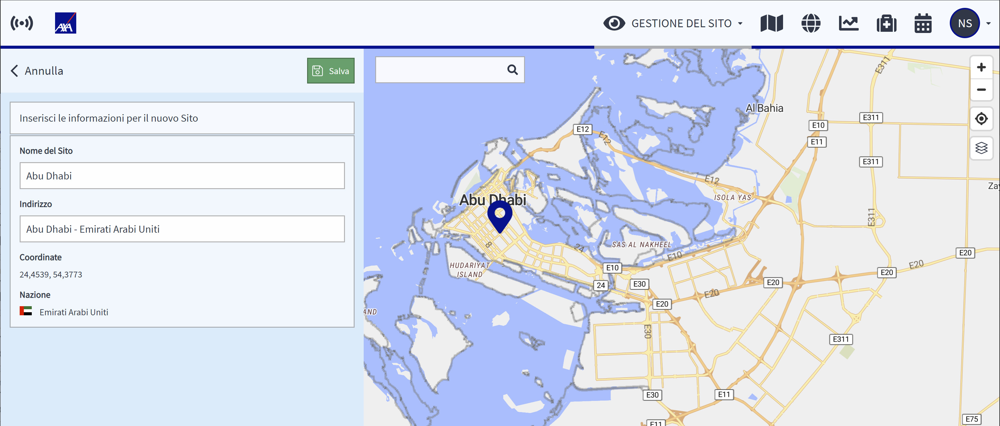

# Siti

Come ottenere una panoramica dei vostri siti? Cliccate sul pulsante dei siti nel menu del  Monitoraggio dei Viaggi per visualizzare un elenco dei siti e degli uffici della vostra azienda, se li avete integrati. Utilizzate la barra di ricerca per trovare un sito specifico. Potete cercare il nome di un sito o effettuare una ricerca per paese/paesi per visualizzare più siti situati in quei paesi.

Cliccate sull'icona di un sito sulla mappa o su un sito nell'elenco per visualizzare i dettagli disponibili: l'indirizzo del sito e le coordinate esatte della sua posizione.

### Gestione dei siti – Come posso integrare i siti aziendali?

Selezionate l‘icona del Monitoraggio die Viaggi dalla barra di navigazione e cliccate su Gestione die Siti per accedere all‘pannello di modifica.

Se avete già delle sedi dell‘azienda integrate, potete modificarle o cancellarle facilmente cliccando sulla freccia che trovate alla destra della voce dell‘elenco che desiderate modificare.

Potete aggiungere nuovi uffici o siti di progetto cliccando su + Aggiungi sito. Utilizzate la barra di ricerca della mappa per trovare la localizzazione desiderata e posizionate il marcatore per impostare la posizione esatta. Indicate il nome del sito e confermando cliccando sul pulsante verde “Salva”. Sullo schermo apparira il messaggio di conferma “Sito aggiungo con successo”

