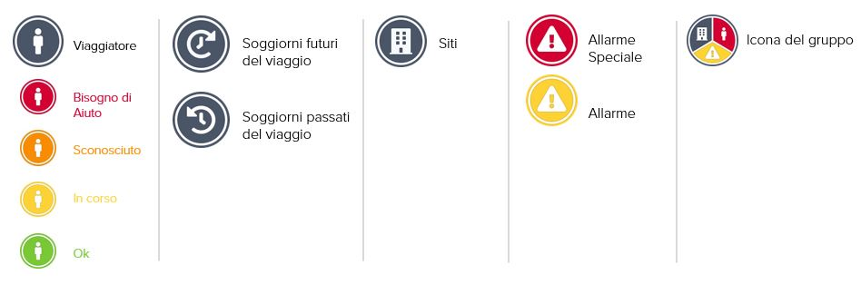

# Status e Icone

Sulla mappa del Monitoraggio dei Viaggi utilizziamo le seguenti icone.


Più viaggiatori, siti e allarmi nella stessa posizione \(a seconda del livello di zoom\) sono raggruppati in un'unica icona. Cliccare sull'icona del gruppo per separare le informazioni su ogni oggetto raggruppato.


Le icone dei viaggiatori hanno colori diversi a seconda del loro **stato nelle ultime 72 ore**:

| Colore | Status | Descrizione |
| :--- | :--- | :--- |

<table>
  <thead>
    <tr>
      <th style="text-align:left">Verde</th>
      <th style="text-align:left"><b>Ok</b>
      </th>
      <th style="text-align:left">
        <ul>
          <li>Feedback di stato da parte dei viaggiatori come risposta alla chiamata
            di stato automatica che stanno bene</li>
          <li>Feedback di stato da parte dei viaggiatori via e-mail o per telefono che
            stanno bene</li>
          <li>Feedback di stato che il viaggiatore sta bene, attraverso uno dei contatti
            di emergenza via e-mail o telefono</li>
        </ul>
      </th>
    </tr>
  </thead>
  <tbody></tbody>
</table>

<table>
  <thead>
    <tr>
      <th style="text-align:left">Giallo</th>
      <th style="text-align:left"><b>In corso</b>
      </th>
      <th style="text-align:left">
        <ul>
          <li>La serie di chiamate di stato automatiche &#xE8; ancora in corso. Non
            &#xE8; stato ancora trasmesso alcun feedback di stato.</li>
        </ul>
      </th>
    </tr>
  </thead>
  <tbody></tbody>
</table>

<table>
  <thead>
    <tr>
      <th style="text-align:left">Arancione</th>
      <th style="text-align:left"><b>Sconosciuto</b>
      </th>
      <th style="text-align:left">
        <ul>
          <li>Tutte le chiamate di stato sono state effettuate e non &#xE8; stato trasmesso
            alcuno stato (telefono spento, segreteria telefonica, nessuna connessione).</li>
          <li>Il feedback sullo stato &#xE8; fornito da terzi, cio&#xE8; non dal viaggiatore
            stesso o da uno dei contatti di emergenza. Il fornitore di servizi di assistenza
            informa i contatti di emergenza, compresi i nomi e i dati di contatto.</li>
        </ul>
      </th>
    </tr>
  </thead>
  <tbody></tbody>
</table>

<table>
  <thead>
    <tr>
      <th style="text-align:left">Rosso</th>
      <th style="text-align:left"><b>Bisogno di Aiuto</b>
      </th>
      <th style="text-align:left">
        <ul>
          <li>Feedback di stato da parte dei viaggiatori che hanno bisogno di aiuto
            in risposta diretta alla chiamata di stato automatica.</li>
          <li>Il fornitore di servizi di assistenza ha chiare indicazioni che i viaggiatori
            colpiti si trovano in una situazione critica (pericolo per la vita, l&apos;incolumit&#xE0;
            fisica o la salute) e avvier&#xE0; il processo di emergenza.</li>
        </ul>
      </th>
    </tr>
  </thead>
  <tbody></tbody>
</table>

<table>
  <thead>
    <tr>
      <th style="text-align:left">Bianco</th>
      <th style="text-align:left"><b>Nessuno Status</b>
      </th>
      <th style="text-align:left">
        <ul>
          <li>I viaggiatori che non hanno ricevuto una chiamata di stato automatica
            dalla piattaforma nelle ultime 72 ore non hanno alcuno status.</li>
        </ul>
      </th>
    </tr>
  </thead>
  <tbody></tbody>
</table>


Si prega di notare che entrambi gli stati Sconosciuto e Bisogno di aiuto **i**ndicano che i viaggiatori potrebbero essere in pericolo e hanno bisogno di assistenza. Il fornitore di assistenza di emergenza avvierà un caso di assistenza, informerà il contatto di emergenza e coordinerà ulteriori misure.


### **Come funziona la piattaforma e come posso vedere se i viaggiatori sono coinvolti in un incidente?**

La piattaforma rileva e comunica automaticamente lo stato dei viaggiatori registrati.   
Funziona così:

1. La piattaforma rileva un incidente critico per la sicurezza che molto probabilmente rappresenta una minaccia per i viaggiatori nelle immediate vicinanze...
2. L'incidente di sicurezza fa scattare una serie di chiamate di stato automatiche e una speciale e-mail di avviso a seconda delle impostazioni individuali del Monitoraggio dei Viaggi.
3. Ci sono tre possibili risposte di stato che la piattaforma può rilevare**: OK, AIUTO** o **NESSUNA RISPOSTA.** Lo stato attuale dei viaggiatori viene costantemente aggiornato nella piattaforma \(verde **OK,** giallo **IN CORSO,** arancione **SCONOSCIUTO,** rosso **AIUTO\).** Gli stati vengono inoltre costantemente comunicati ai destinatari delle segnalazioni via e-mail. In caso di necessità di intervento \(stato Sconosciuto o Aiuto\), i destinatari delle segnalazioni vengono inoltre informati esplicitamente via e-mail.

### **Posso controllare lo stato di un determinato gruppo di viaggiatori?**

È possibile attivare il rilevamento automatico dello stato anche manualmente, senza alcun collegamento con un allarme speciale per incidente. In questo caso, selezionate i viaggiatori da cui desiderate uno stato aggiornato nell'elenco dei viaggiatori e cliccate sul pulsante "Richiedi stato". La piattaforma chiamerà i viaggiatori selezionati e determinerà il loro stato. È possibile seguire gli stati continuamente aggiornati nel monitor di viaggio \(verde Ok, giallo In Corso, arancione Sconosciuto, rosso Aiuto\). Se è necessaria un'azione \(stato Sconosciuto o Aiuto\), i destinatari della segnalazione vengono informati esplicitamente via e-mail.

