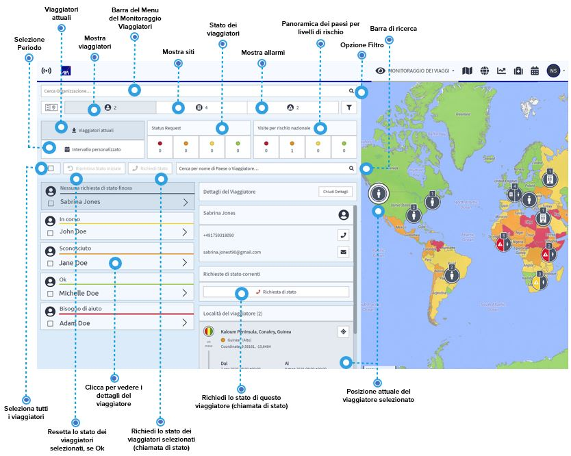

# Viaggiatori

Con un clic sull'icona del viaggiatore si ottiene una panoramica completa dei vostri viaggiatori. Sulla pagina iniziale del monitor di viaggio si può vedere a colpo d'occhio:

* la panoramica dello stato attuale dei viaggiatori, che mostra lo stato dei viaggiatori delle ultime 72 ore 
* il numero di viaggiatori che si trovano in paesi a rischio basso,elevato, alto, estremo 

Per impostazione predefinita, il sistema mostra le informazioni sui viaggi in corso. Se avete bisogno di conoscere i viaggi passati o futuri, utilizzate il pulsante dell'intervallo personalizzato ed effettuate la vostra selezione temporale. In qualsiasi momento, è possibile utilizzare il pulsante rosso per avviare una richiesta di stato automatica per i viaggiatori selezionati per conoscere il loro stato attuale. In questo modo, ad esempio, potete avere un aggiornamento giornaliero dello stato dei vostri viaggiatori verso i paesi ad alto rischio.

Cliccando sull'icona di un viaggiatore o su un viaggiatore nell'elenco, vengono visualizzati i dettagli disponibili: i dati di contatto e le località dei viaggiatori registrati nel sistema. Le località dei viaggiatori forniscono informazioni sui diversi soggiorni del viaggiatore nel tempo, tra cui

* la durata di ogni soggiorno 
* la posizione \(coordinate e posizione sulla mappa\) del soggiorno
* le informazioni dell'ultima chiamata di stato, se disponibile

