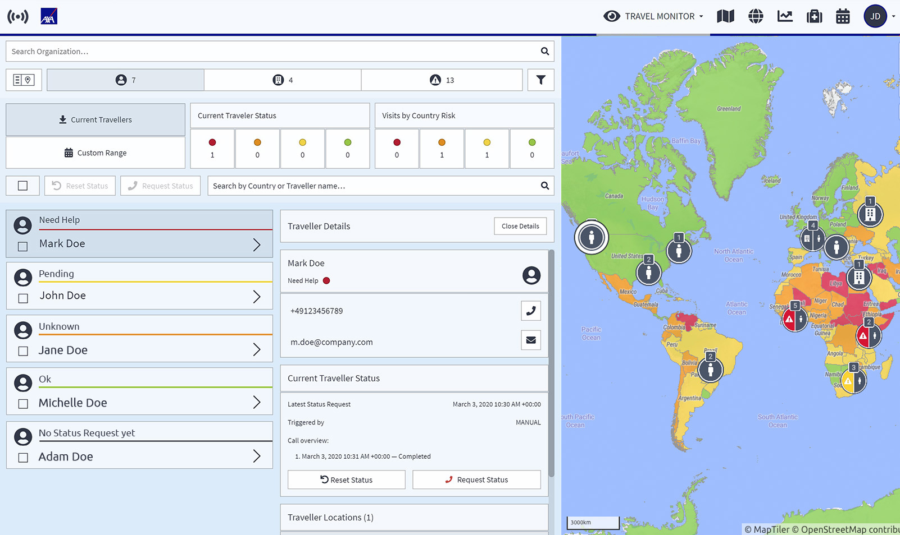
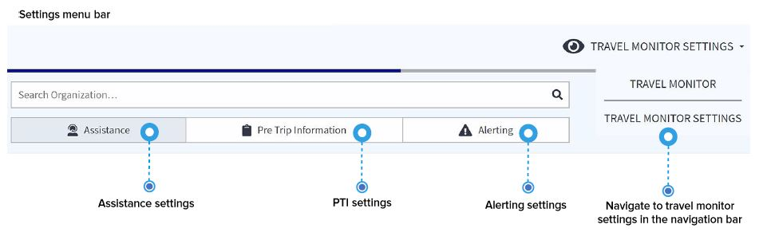

# トラベルモニターの設定

**トラベルモニター**は、本プラットフォームにおいて中心的な役割を果たします。渡航管理者は、世界中の渡航者の状況を確認・把握し、緊急事態の追跡を行い、ステータスリクエストを送信することができます。トラベルモニターは、ユーザーの設定に基づき、アラート、コミュニケーション、企業の緊急時手順を決定付けます。

## トラベルモニターとは、どのような機能ですか？

プラットフォームのセットアップには約10分を要します。全ての設定を決定した後、システムが利用可能となります。

以下の各セクションに関する会社の設定を十分に考慮し決定してください：

* 支援
* 渡航前情報
* アラート


スムーズに利用開始いただくために、デフォルト設定がなされています。


