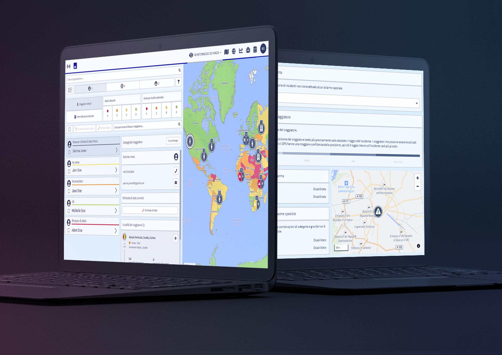
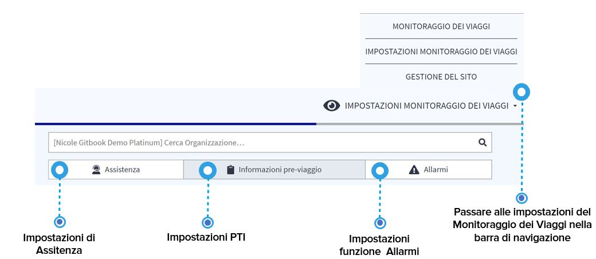

# Impostazioni del Monitoraggio dei Viaggi

Il **Monitoraggio dei Viaggi** è il cuore della piattaforma. I travel manager possono monitorare e controllare i viaggiatori e i loro status in tutto il mondo, tracciare le emergenze e avviare le chiamate di stato. In base alle vostre impostazioni, il Monitoraggio dei Viaggi guida e definisce le procedure di allarme, comunicazione e di emergenza per la vostra azienda.

## Che aspetto ha il Monitoraggio dei Viaggi?

La configurazione della piattaforma richiede circa 10 minuti, una volta definite tutte le impostazioni, il sistema farà il lavoro al posto vostro.

Prendetevi il tempo necessario per definire le vostre impostazioni aziendali nelle sezioni:

* Assistenza
* Informazioni pre-viaggio \(PTI\)
* Allarmi


Si prega di notare che abbiamo preparato una serie di impostazioni predefinite per facilitare l'avvio.


