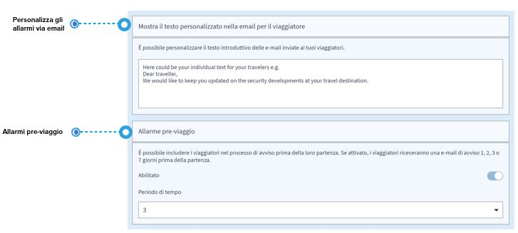
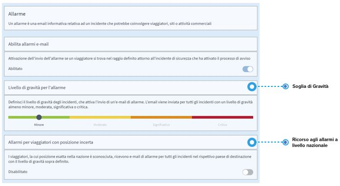
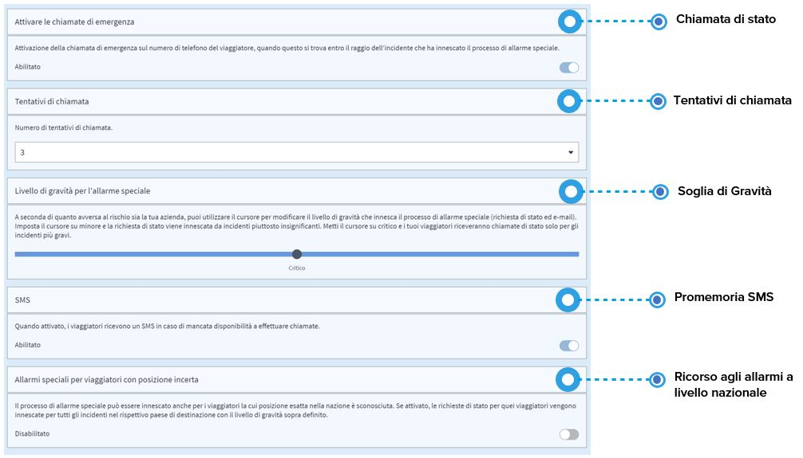
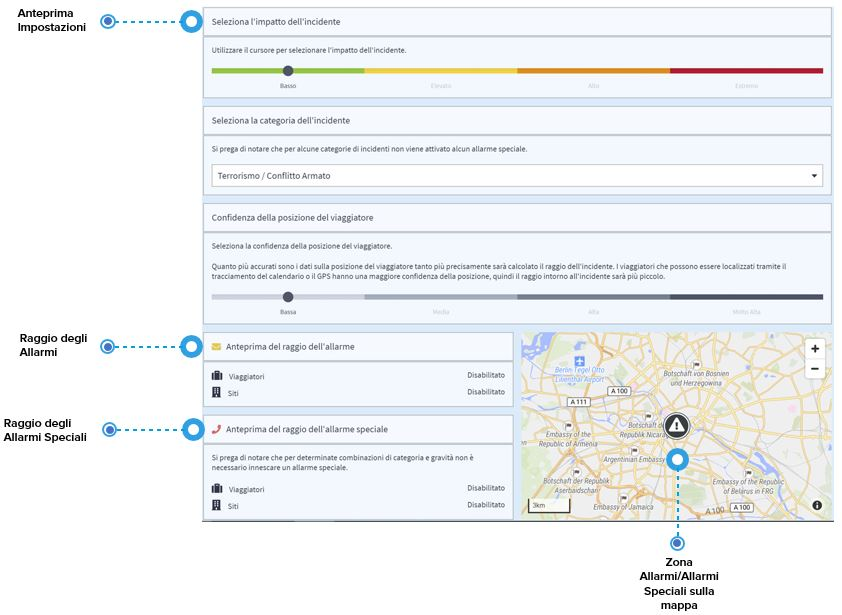

# Allarmi

## Cos'è la funzione "Allarmi"?

Allarmi, in questo caso, è un termine generico per indicare gli allarmi e gli allarmi speciali e le loro procedure di comunicazione successive:

1. **Allarme:** un'informazione via e-mail su un incidente che ha possibili effetti su viaggiatori, siti o attività commerciali.
2. **Allarme speciale:** un'informazione via e-mail su un incidente critico per la sicurezza che si verifica in prossimità dei viaggiatori e che quindi può avere effetti sul personale, sui siti o sulle attività commerciali. La stessa email include anche linee guida comportamentali per i viaggiatori che si trovano nelle vicinanze di un tale incidente. La cosa più importante è che **un avviso speciale fa scattare immediatamente una serie di chiamate automatiche di stato** ai viaggiatori che potrebbero essere coinvolti per sapere se stanno bene o se hanno bisogno di assistenza.

## Quali sono le impostazioni generali?

Personalizzare le email di allarme e utilizzare l'allarme pre-viaggio.

* Innanzitutto, **è possibile personalizzare il testo introduttivo delle e-mail di allarme** inviate ai viaggiatori, in modo che possano riconoscerle come un messaggio affidabile da parte del loro datore di lavoro/azienda. Ad esempio: _Questa e-mail viene inviata per conto della VOSTRA AZIENDA. Ci piace tenervi al sicuro e aggiornati durante i vostri viaggi. Vi preghiamo di leggere attentamente quanto segue..._
* Potete includere i viaggiatori nel **processo di allarme prima del loro viaggio**. Se attivata, i viaggiatori ricevono e-mail di allerta 24h, 48h, 72h o 7 giorni prima del viaggio. Spesso è utile essere informati su ciò che accade nel Paese prima della partenza per prepararsi di conseguenza, ad esempio per riorganizzare il ritiro e il trasporto all'aeroporto, ecc.

## **Come si imposta l'allarme \(e-mail\)?**

Un allarme è un'informazione via email su un incidente che ha possibili effetti su viaggiatori, siti o attività commerciali. Se attivate l'allarme, le seguenti impostazioni saranno applicate per la vostra azienda.

**Qual è la soglia di allarme?** È possibile definire la soglia di gravità per gli incidenti che fanno scattare l'invio di e-mail di allerta. A seconda di dove si imposta il cursore, i destinatari dei vostri report e i vostri viaggiatori riceveranno e-mail di allerta per incidenti di gravità almeno **minima, moderata, significativa o critica.**


Se si desidera che i viaggiatori siano avvertiti solo degli incidenti più gravi, impostare il cursore su "critico". Se si preferiscono informazioni di sicurezza più ampie, impostare il cursore su moderato.


## **Come si imposta l'allarme apeciale \(e-mail e chiamata di stato\)?**

Un allarme speciale viene attivato, se si verifica un incidente critico e i vostri viaggiatori sono nelle vicinanze, all'interno della zona di impatto dell'incidente. In questo caso, volete sapere il prima possibile se i vostri viaggiatori stanno bene. **In caso di allarme speciale, i viaggiatori interessati vengono chiamati al numero di telefono registrato** per conoscere il loro stato \(chiamata di stato\). La piattaforma scoprirà se un viaggiatore sta bene o ha bisogno di aiuto e informerà automaticamente i destinatari della segnalazione. Oltre alla chiamata di stato, i viaggiatori ricevono anche le informazioni sull'incidente con le raccomandazioni via e-mail.

#### Che impostazioni posso scegliere?

* Potete determinare il numero di **chiamate di stato** \(3-5\) ai vostri viaggiatori in caso di emergenza. Spesso i viaggiatori non rispondono immediatamente alla prima o alla seconda chiamata. Chiamarli più volte con circa 5-10 minuti di intervallo tra una chiamata e l'altra significa avere maggiori possibilità che rispondano e diano informazioni sul loro stato. Ai viaggiatori che non rispondono al telefono \(telefono spento, segreteria telefonica, nessuna risposta, nessuna connessione\) viene assegnato lo stato "sconosciuto". I contatti di emergenza vengono informati e il loro stato deve essere seguito.
* **Promemoria via SMS e e-mail**: I viaggiatori con lo status sconosciuto che non hanno risposto alla chiamata di stato, riceveranno un'e-mail e un SMS con la richiesta di fornire informazioni sul loro stato. L'intenzione è di farli richiamare o di inviare un'e-mail al loro contatto di emergenza non appena ricevono il messaggio. Se non si desidera che venga inviato un SMS in aggiunta all'e-mail, è possibile disattivarlo.
* Il processo di allarme speciale può essere avviato anche per i viaggiatori **la cui posizione esatta nel paese è sconosciuta**. Una volta attivata, le chiamate di stato vengono effettuate per tutti gli incidenti nel rispettivo paese di destinazione con la soglia di gravità sopra definita.

### **Come faccio a sapere se ho impostato correttamente gli allarmi e gli allarmi speciali?**

Se non siete sicuri delle vostre impostazioni o siete semplicemente curiosi di sapere come funziona la piattaforma, potete controllare la sezione "Anteprima del raggio d'azione dell'incidente". Sulla base di una serie di parametri, la piattaforma definisce dinamicamente i singoli raggi di impatto per gli allarmi e gli allarmi speciali intorno a un incidente di sicurezza. Tra i parametri più forti che modellano il raggio ci sono l'impatto dell'incidente, la categoria dell'incidente e l'accuratezza della localizzazione del viaggiatore.


Testate le vostre impostazioni prima di utilizzare la piattaforma!


### Come si fa?

Utilizzate il cursore e selezionate un **livello di impatto di un incidente**, definire una categoria **di incidente** e selezionare **la precisione della posizione**: nel grafico si può vedere come il raggio dell'incidente cambia di conseguenza**.**


**Si prega di notare** che alcune categorie di incidenti, per natura, non fanno scattare una speciale chiamata di stato di allerta.



**Nota sull'accuratezza della localizzazione del viaggiatore:** Quanto più precisi sono i dati di localizzazione del viaggiatore, tanto più preciso è il raggio dell'incidente. Se la registrazione del viaggio è limitata ai dati di volo, ad esempio, il viaggiatore sarà localizzato all'aeroporto di arrivo e in questo caso la precisione della localizzazione è bassa perchè è probabile che il viaggiatore si sposti dopo l'arrivo. Pertanto, la piattaforma disegna un raggio più ampio intorno agli incidenti. I viaggiatori che utilizzano il tracciamento del calendario o il GPS, invece, hanno una maggiore accuratezza di localizzazione, quindi il raggio intorno agli incidenti sarà più piccolo e l'allarme sarà più preciso  


### 

