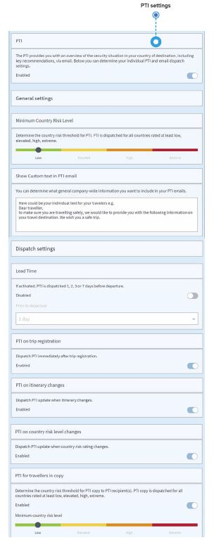

# 渡航前情報

## 渡航日を前に渡航者が受け取る国情報を把握するにはどうすればよいですか？

渡航前情報（PTI）は、重要な推奨事項を含む渡航先の国のリスク状況の概要を伝えるものです。さらに具体的には、出発国や経由国を含め、渡航者が期間中に訪問する各国のPTIが用意されています。

**PTIは出発前に電子メールで送信されます。**会社の必要に応じて、以下のPTIや電子メール配信の設定を行うことができます。

### 主な機能と設定

* PTIを非アクティブ化しない限り、**PTIは登録された渡航者のメールアドレスに配信されます。**
* 渡航者に送信される**PTIメールの冒頭のテキストをカスタマイズすることができます。**そうすることで、渡航者は送信された内容を雇用主/会社からの信頼できるメッセージであると認識します。 例文：本メールは（会社名）に代わり送信されています。以下の渡航先の国に関する情報をよくお読みください…お気をつけて行ってらっしゃいませ。
* **PTI 送信に関わるカントリーリスクのしきい値を規程してください。**PTIは全ての国を対象としていますが、「低い」「中程度」「高い」「極めて高い」の各しきい値に応じて配信されます。 設定を行うことで、例えばリスクが低い国のPTIを受信しなくなります。
* **レポートの受信者向けにカントリーリスクのしきい値を規程してください。**全ての国に関するPTIのコピーが、「低い」「中程度」「高い」「極めて高い」の各しきい値に応じて配信されます。このプロセスにより、全員の渡航情報が受信できるだけでなく、注意義務を果たしていることの証明にもつながります。 
* **渡航登録後、即座にPTIを受信する**: これは、渡航予定登録が無事完了したことを確認したい渡航者にとって望ましい機能といえます。コピーを受信すれば、渡航予約や渡航予定登録完了後、この機能により即座に情報を得ることができます。
* リードタイム: **出発前の24時間、48時間、72時間または7日間の中からPTI配信のタイミングを選択可能です。**会社の登録情報に従って、出発の何日前に渡航者が情報を受信し、準備を整えることが可能となるかを決定することができます。もし設定により渡航予定登録の直後にPTIが送信された場合、上述の配信は追加のリマインダーとなります。
* **旅程が変更された時にPTIの更新を受信する**: 渡航予約は、特に既存のPNRが変更された際には複雑になることがあります。日時、航空会社、渡航先や経由地などの情報が変更・追加されます。この機能を選択することで、渡航予約が変更となった場合に、渡航者はPTIによって包括的な情報を確実に入手することができます。
* **国リスクレベルに変更があった場合にPTIの更新情報を配信する**: 会社の渡航規則に基づき、リスク評価次第で渡航先の国に対して異なるプロセスを取ることが想定されます。この機能により、リスク評価が引き上げられた国への渡航について、予約がすでに完了している場合でも、フォローアップを行い、必要に応じて安全対策を講じることができます。 
* **出発空港を除外する**: この設定を行った場合、出発空港での滞在向けにPTIが配信されることはありません。目的地の国に関するPTIのみ配信されます。
* **所属国のPTIを受信しない**: この設定が有効化された場合、渡航者は所属国での滞在や渡航に関するPTIを受信することはありません。ユーザーは、ユーザープロファイル上で所属国を設定することができ、その場合には担当者が主要なアカウント管理者に確認が必要となる会社全体のデフォルトの国設定が無効化されることに留意してください。具体例：ドイツに拠点を置く会社が、ドイツのPTIを全体的に除外したいと考えているとします。そして、同じドイツの会社の従業員が、フランスで勤務しているとします。この場合、この従業員は自身のユーザープロファイルを設定し、フランスのPTIの受信を無効化することができます。  
* **最低滞在期間:** 短期滞在（乗り継ぎなど）を設定することも可能です。この場合、渡航者にPTIは配信されません。この設定を行った場合、1時間、2時間、4時間、8時間よりも短い滞在の場合にPTIは配信されません。

