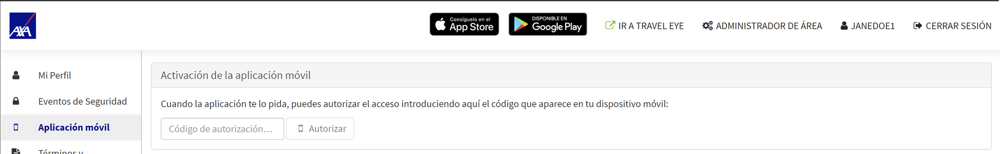

# Aplicación de Travel Eye

### Aplicación de Travel Eye

Travel Eye también está disponible como **aplicación web basada en navegador** y como **aplicación móvil nativa**, y le ofrece todas las potentes funciones de la versión de escritorio:

* **Llamadas de Emergencia**: si está en peligro, puede contactar con el Centro de Operaciones AXA 24/7
* **Llamadas de Estado**: si ocurre un incidente de seguridad cerca, recibirá llamadas para comprobar si necesita ayuda
* **Alerta**: recibirá correos electrónicos que le informarán sobre los últimos acontecimientos e incidentes de seguridad en el lugar
* **Información Previa al Viaje**: recibirá la información de seguridad y sanidad más reciente antes de su salida
* **Información de Seguridad para el Viaje**: puede acceder a toda la información relevante de su destino de viaje en cualquier momento

## App Web basada en Navegador

La App Web basada en Navegador es la opción favorita para empresas que normalmente no permiten descargar de la Play Store o la Apple Store. Sin descargar la aplicación desde allí, los usuarios tendrán acceso a todas las funcionalidades por el navegador, incluidos compartir la geolocalización y el botón de emergencia.

## App Nativa

La Aplicación de Travel Eye para IOS y Android está disponible \(Play Store o App Store\) con todas las funcionalidades de la aplicación de escritorio de TRAVEL EYE.

## Activación de la App

Para activar la aplicación, siga estos pasos:

1. Inicie sesión en la plataforma como normalmente y abra su perfil de usuario. Clique «_Aplicación móvil_» en la parte izquierda de la pantalla. 
2. Instale e abra la aplicación en su dispositivo móvil. La pantalla de bienvenida de la aplicación muestra un código de autorización de 8 letras. 
3. Introduzca el código en el campo «_Código de autorización_...» en su perfil de usuario y clique «_Autorizar_». 
4. Ahora ha iniciado sesión de forma permanente en la aplicación en su dispositivo móvil.

