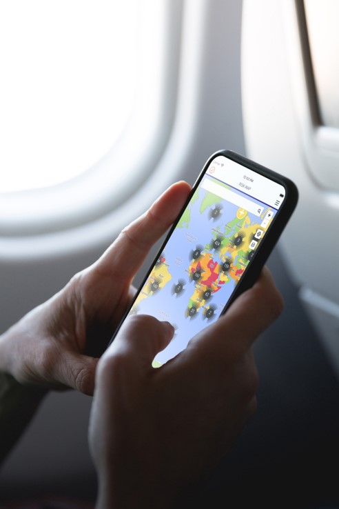
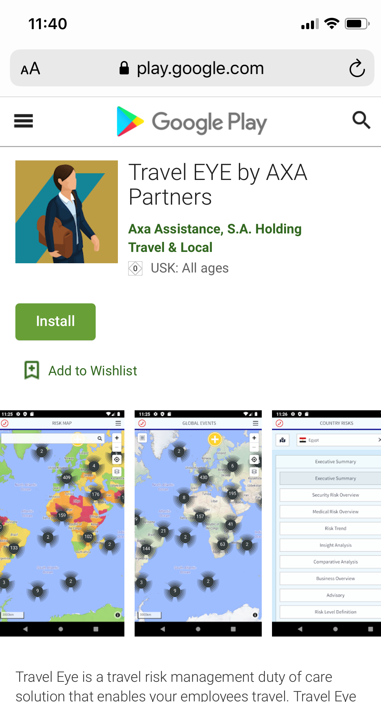

# Travel Eyeアプリ

Travel Eyeは、**ブラウザベースのウェブアプリ**か**ネイティブモバイルアプリ**として利用可能であり、後者にはデスクトップ版の全ての豊富な機能が提供されています：

* **緊急通話** – 危険にさらされた場合にも、24時間年中無休でAXAオペレーションセンターにつながります
* **ステータスコール** – 付近で治安事件が発生した場合、利用者は支援が必要かを確認するための電話を着信します
* **アラート** - 最新のセキュリティ状況や現地で発生している事件を伝える電子メールを受信します
* **渡航前情報** – 出発前に最新のセキュリティおよび医療情報を受け取ります
* **トラベルセキュリティ情報** – ユーザーは常に渡航先に関連する全ての情報にアクセスすることが可能です

## ブラウザベースのウェブアプリ

ブラウザベースのウェブアプリは、通常PlayまたはApple Store経由でのダウンロードを許可していない企業に推奨されるオプションです。ストアからアプリをダウンロードしない場合、ユーザーはブラウザ経由でロケーション共有や緊急ボタンなどの全ての機能を利用することができます。 

## ネイティブアプリ

IOSやAndroid対応のTravel Eyeアプリが利用可能です（Play StoreまたはApp Storeからダウンロード\)。TRAVEL EYEデスクトップアプリケーションの全ての機能を備えています。

## アプリの起動

アプリを起動させる際には、以下の手順に従ってください：

1. 通常通りにプラットフォームにログインし、ユーザープロファイルを開いてください。画面左側の「Mobile App」をクリックします。 
2. モバイル機器にアプリをインストールし、起動させます。アプリの初期画面に8文字の認証コードが表示されます。  
3. ユーザープロファイル内の空欄に「認証コード」を入力し、「認証」をクリック。 
4. ご利用のモバイル機器でアプリに永続的にログインされます。

